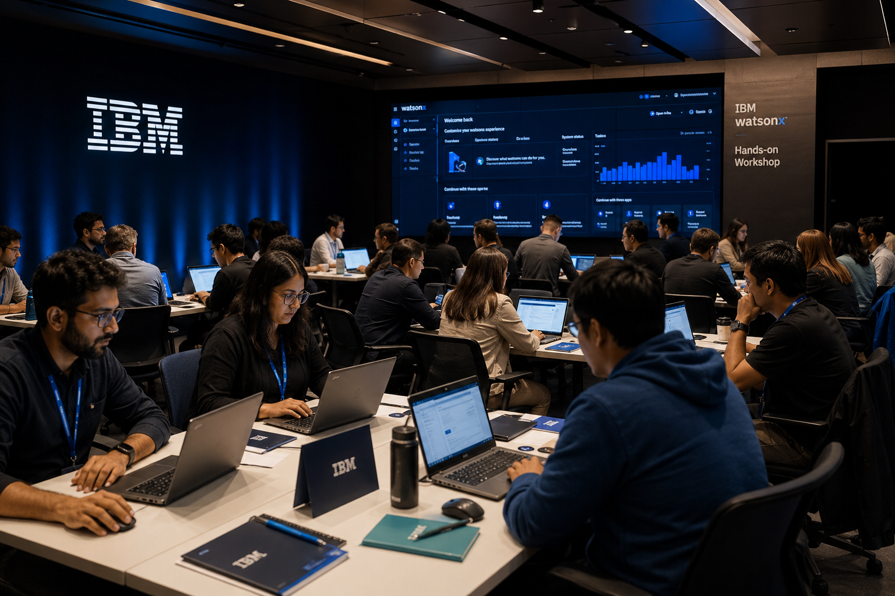
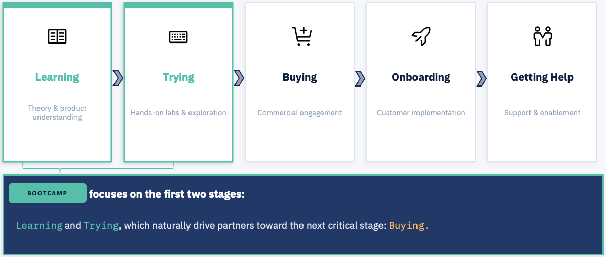

# Welcome to IBM Americas Select-territory Partner Market Launchpad

*AI Generated image*

Partner Market Launchpad is a structured, immersive enablement program designed to take our select-t growth partners from product-unfamiliar to customer-ready quickly.

---

## What is Partner Market Launchpad?

Partner Market Launchpad is enablement for partners to upskill in priority products that solve specific customer challenges. It includes:

1. **Focused product enablement:** Partners gain deep expertise in priority products tailored to target customer challenges.
1. **Upskilling at Scale:** Structured learning that moves partners from unfamiliar to confident quickly and consistently.
1. **Strategic Entry Points:** Products selected as high-impact entry points that land value immediately and expand over time.

---

## Why it matters?

1. **Real world use cases:** We align core offerings with genuine business problems our customers face.
1. **Land and expand model:** Strategic entry products deliver immediate value while positioning additional solutions for growth.
1. **Focused Select-T partners:** Partners entering the new Select-T markets need consistent, structured support across their entire journey.
1. **Focused conversations:** By targeting specific challenges, partners drive more impactful, meaningful customer conversations.

---

## Who is it for?

| Audience | Role |
|---|---|
| **Growth partners** | All the Growth partners from Americas market. |
| **Business / Technical Leaders** | The technical decision makers and architects on the client side evaluating fit |
| **Select-T Clients** | The clients who are the target audience for the products being taught |

**Cohort size:** ~20 attendees per run for optimal hands-on lab experience.

---

## How is it delivered?

Partner Market Launchpad runs **in-person** for maximum impact, and consists of two phases:

- **Phase 1:** Deep-dive into the 'What' and 'Why' of each focused product. Partners build context on the problems IBM technology solves and how it creates customer value.
- **Phase 2:** Hands-on guided labs from basics, fundamentals to advanced. Each lab builds on real world use cases specific to domains, enabling partners to implement the use cases with confidence.

---

## The Partner Pipeline

Partner Market Launchpad focuses on the first two stages of the partner journey:

By accelerating **Learning** and **Trying**, the program naturally drives partners toward **Buying**.

---

## Navigate the Program

- :material-map-outline: **[Program Overview](program/overview.md)**  
  Goals, structure, and what to expect

- :material-account-group: **[Intended Audience](program/audience.md)**  
  Who should attend and why

- :material-calendar-clock: **[Mode of Conduct](program/mode-of-conduct.md)**  
  Delivery format and scheduling options

- :material-flask: **[Track 01](tracks/track-01/index.md)**  
  Jump straight into the first product track

- :material-human-male-board: **[Facilitator Guide](facilitator/running-the-program.md)**  
  Everything you need to run a session

- :material-book-open-variant: **[Resources](resources/further-reading.md)**  
  Docs, glossary, and support links

