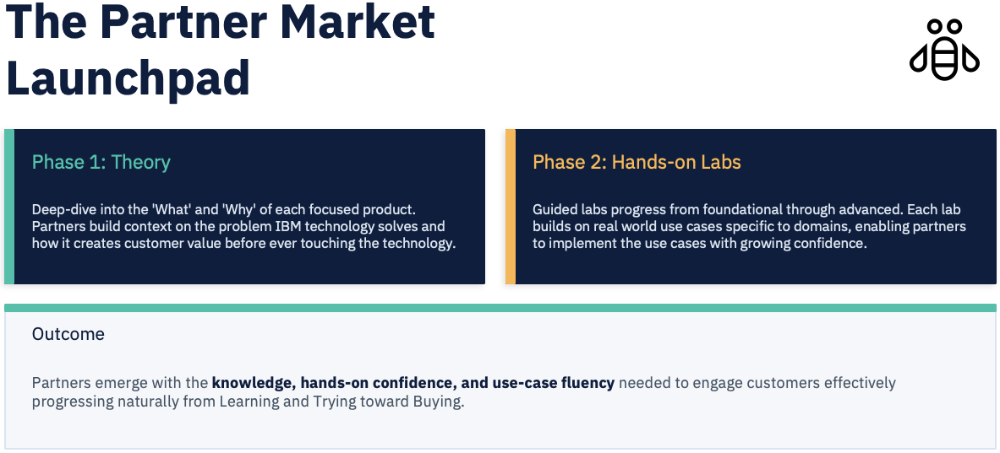

# Program Overview

Partner Market Launchpad is a focused enablement sprint not a generic training program. Each run is anchored to a specific priority product selected because it solves a real, pressing challenge for our target customers.

## Goals

- Build **product fluency** so partners can articulate the value proposition confidently
- Develop **hands-on confidence** through progressive lab scenarios
- Accelerate the partner journey from onboarded to **actively selling**
- Create **consistent, repeatable** enablement that scales across partner cohorts

## Program Structure

## Lab Progression

Each lab builds on the last, progressively increasing in complexity and real-world applicability.

| Lab | Level | Focus |
|-----|-------|-------|
| **101** | Basics | Core concepts, architecture, foundational setup |
| **201** | Fundamentals | Primary use case, essential workflows |
| **301** | Intermediate | Real-world scenario, customer challenge context |
| **401** | Advanced | Complex integrations, optimization, edge cases |

## Outcome

Partners complete the program with the **knowledge**, **hands-on confidence**, and **use-case fluency** to engage customers in meaningful product conversations and move the pipeline from *Learning* and *Trying* toward *Buying*.
