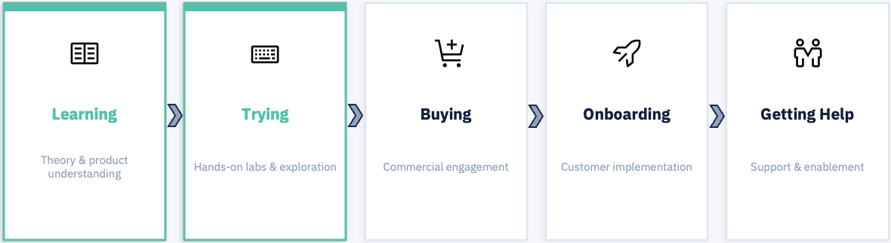

# Partner Pipeline

Partner Market Launchpad is positioned at the start of the partner journey deliberately focused on the stages where enablement has the highest leverage.

## The Pipeline

| Stage | Description | Launchpad Focus |
|-------|-------------|-----------------|
| :material-book-open-variant: **Learning** | Understanding the product, its value, and the problem it solves along with the market landscape and IBM's vision | :material-check: Phase 1: Theory |
| :material-flask: **Trying** | Hands-on exploration and building confidence with real use cases | :material-check: Phase 2: Labs 101–401 |
| :material-credit-card: **Buying** | Commercial engagement and deal progression | :material-arrow-right: Natural next step |
| :material-rocket-launch: **Onboarding** | Customer implementation and deployment | - |
| :material-handshake: **Getting Help** | Ongoing support and partner success | - |

## Why Start Here?

Partners entering new markets need consistent, structured support. Without a strong foundation in **Learning** and **Trying**, partners lack the confidence and fluency to drive meaningful customer conversations stalling the pipeline before it even starts.

!!! success "The Launchpad Effect"
    By accelerating the first two stages, Partner Market Launchpad compresses the time between a partner being onboarded and a partner being commercially active. More activated partners, earlier in the year, means more qualified pipeline.
