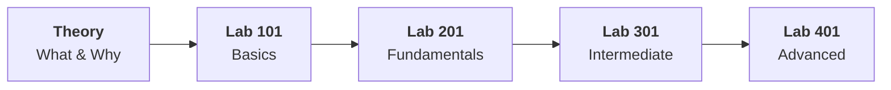

# Track 01 — Boost productivity with AI agents

*AI Generated image*

## Track Overview

| Fields | Details |
|-------|--------|
| **Products** | [watsonx Orchestrate](https://www.ibm.com/products/watsonx-orchestrate)  [watsonx.governance](https://www.ibm.com/products/watsonx-governance)   [IBM Bob](https://bob.ibm.com/) |
| **Target Persona** | select-t partners, BTS and select-t clients|
| **Theory sessions** | 2 |
| **Labs** | 4 |
| **Estimated Duration** | ~6–7 hrs (excluding breaks) |

---

## Learning Journey

## Before You Begin

- Complete the [Program Overview](../../program/overview.md) if you haven't already.
- Create an IBMid by referring to the [instructions here](/facilitator/create-ibm-id/).
- Ensure your lab environment is set up per the [Track 01 Lab Environment Setup Guide](lab-environment-setup.md).

---

## Theory Sessions

- :material-lightbulb-on: **[Market Landscape of Agentic AI](theory/what-and-why.md)**
  Introduction to the market landscape and IBM’s vision and offerings in that market.

- :material-package-variant: **[Product Overview](theory/product-overview.md)**
  Introduction to the select-t focused products

---

## Hands-on Labs

- :material-numeric-1-box: **[Lab 101 — Basics](labs/lab-101/index.md)**
  Getting started with core concepts

- :material-numeric-2-box: **[Lab 201 — Fundamentals](labs/lab-201/overview.md)**
  Building foundational skills

- :material-numeric-3-box: **[Lab 301 — Intermediate](labs/lab-301/overview.md)**
  Advancing your expertise

- :material-numeric-4-box: **[Lab 401 — Advanced](labs/lab-401/overview.md)**
  Mastering complex implementations

---

## Support

- :material-wrench: **[Troubleshooting](troubleshooting.md)**
  Common issues and solutions

