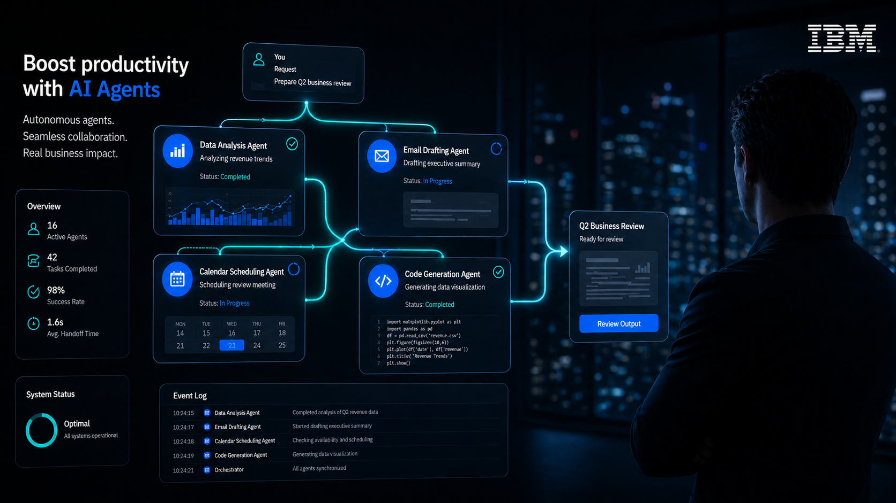
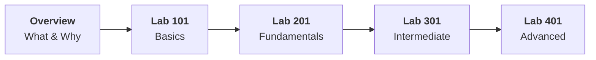

# Track 01 — Boost productivity with AI agents

*AI Generated image*

## Track Overview

| Fields | Details |
|-------|--------|
| **Products** | :material-numeric-1-box: [watsonx Orchestrate](https://www.ibm.com/products/watsonx-orchestrate)  :material-numeric-2-box: [watsonx.governance](https://www.ibm.com/products/watsonx-governance)   :material-numeric-3-box: [IBM Bob](https://bob.ibm.com/) |
| **Target Persona** | Select-t growth partners, Business/Technical Leaders and Select-t clients|
| **Overview sessions** | 2 |
| **Lab sessions** | 4 |
| **Estimated Duration** | ~6–7 hrs (excluding breaks) |

---

## Learning Journey

```mermaid
flowchart LR
    theory["<strong>Overview</strong><br/>What & Why"] --> lab101["<strong>Lab 101</strong><br/>Basics"]
    lab101 --> lab201["<strong>Lab 201</strong><br/>Fundamentals"]
    lab201 --> lab301["<strong>Lab 301</strong><br/>Intermediate"]
    lab301 --> lab401["<strong>Lab 401</strong><br/>Advanced"]
```

!!! warning "Before You Begin"

    - Complete the [Program Overview](../../program/overview.md) if you haven't already.
    - Create an IBMid by referring to the [instructions here](../../facilitator/create-ibm-id.md).
    - Ensure your lab environment is set up per the [Track 01 Lab Environment Setup Guide](lab-environment-setup.md).

---

## Overview

- :material-lightbulb-on: **[Market Landscape of Agentic AI](theory/what-and-why.md)**
  Introduction to the market landscape and IBM’s vision and offerings in that market.

- :material-package-variant: **[Product Overview](theory/product-overview.md)** 
  Introduction to the select-t focused products

---

## Hands-on Labs

### Lab 101 - Basics lab

!!! tip "Goal"
    In this basic, you'll learn core concepts, explore the architecture overview, and complete the foundational setup. You'll understand what watsonx Orchestrate does and why it exists through hands-on experience in your chosen domain. You will use the low-code way of building AI Agents in these labs.

-   :material-cart: **AI Powered customer service for retail**

    ---

    In the logistics and shipping industry, customer satisfaction hinges on quick updates, transparent delivery tracking, and smooth returns. The AI-Powered Customer Service solution enables companies to handle customer queries related to delivery status, shipment tracking, returns, and claims through an intelligent virtual assistant.
    
    [:octicons-arrow-right-24: Start Lab](labs/lab-101/retail/use-case-1/details.md){ .md-button .md-button--primary }

- :material-shield: **AI Powered insurance broker assistant**
  
    ---

    In the insurance industry, broker productivity depends on fast access to accurate customer and policy data. Brokers spend significant time switching between systems, manually querying databases, and compiling policy summaries time that could be spent on higher value client interactions.

    [:octicons-arrow-right-24: Start Lab](labs/lab-101/insurance/use-case-1/details.md){ .md-button .md-button--primary }

-   :fontawesome-solid-users-line: **HR use case**

    ---

    One of the main challenges faced by any big organization is their HR operations management. As companies grow in size, it becomes increasingly difficult to get information faster and execute tasks with ease. With the advent of Agentic systems, and the power or reasoning models, it becomes easier to have a single entry point for doing mostly every HR operation.

    [:octicons-arrow-right-24: Start Lab](labs/lab-101/hr/hr-agent/details.md){ .md-button .md-button--primary }

-   :material-car: **Vehicle maintenance**

    ---

    The Vehicle Maintenance Assistant is an AI Agent designed to help car owners identify and understand vehicle issues by interpreting natural language inputs like “My car is shaking” or “Check engine light is on.” It combines real-time telematics data, diagnostic trouble codes (DTCs), and vehicle documentation to offer personalized, accurate diagnostics and actionable guidance such as finding nearby service centers, etc.

    [:octicons-arrow-right-24: Start Lab](labs/lab-101/automobile/use-case-1/details.md){ .md-button .md-button--primary }

!!! note "Learning Objectives"
    By the end of this lab, you will be able to:

    - Building AI Agents with Low-code Agent Builder
    - Building AI Agents with pre-built tools and agents from the Catalog
    - Connections in watsonx Orchestrate
    - Knowledge Bases - Basic RAG
    - Web chat embedding - Basic
    - OpenAPI tools
    - Monitoring & Observability

---

### Lab 201 - Foundational lab

!!! tip "Goal"
    In this foundational lab, you'll build upon the basics and dive deeper into fundamental concepts. You'll work with more advanced features and learn how to implement practical solutions in your chosen domain.

- :material-finance: **Financial research and analysis**
  
    ---

    A smart assistant designed to support financial advisors across their client engagement lifecycle. It autonomously generates personalized investment reports, summarizes meeting outcomes, drafts follow-up communications, and delivers real-time market and financial insights.

    [:octicons-arrow-right-24: Start Lab](labs/lab-201/financial-services/wealth-manager/details.md){ .md-button .md-button--primary }

- :fontawesome-solid-warehouse: **Supply chain use case**

    ---

    This use case demonstrates how AI-powered agents can streamline end-to-end supply chain operations by handling domain-specific tasks and collaborating autonomously to achieve operational efficiency and business continuity.

    [:octicons-arrow-right-24: Start Lab](labs/lab-201/supply-chain/use-case-1/details.md){ .md-button .md-button--primary }

!!! note "Learning Objectives"
    By the end of this lab, you will be able to:

    - Building AI Agents with Pro-code Agent Builder
    - Multi-agent collaboration with external agents
    - Python tools

---

### Lab 301 - Intermediate lab

!!! tip "Goal"
    In this intermediate lab, you'll tackle more complex scenarios and integrate multiple components. You'll learn advanced techniques and best practices for building production-ready AI Agents in your domain.

- :fontawesome-solid-legal: **Document processing with agentic workflows**
  
    ---

    Build a document classification agentic workflow capable of classifying and extracting data from documents such as contracts and invoices. The agent uses document classification and document extraction to automate data processing and minimize manual work.

    [:octicons-arrow-right-24: Start Lab](labs/lab-301/legal/document-processing/details.md){ .md-button .md-button--primary }

- :material-bank-outline: **Self-service KYC Assistant**

    ---

    WIP 

    [:octicons-arrow-right-24: Start Lab](){ .md-button .md-button--primary }

- :material-bank-outline: **Flight Booking Assistant**

    ---

    WIP

    [:octicons-arrow-right-24: Start Lab](){ .md-button .md-button--primary }

!!! note "Learning Objectives"
    By the end of this lab, you will be able to:

    - Deterministic Agent
    - Agentic AI workflow tool for deterministic flows
    - Long running tasks
    - Human-in-the-loop approvals
---

### Lab 401 - Advanced lab

!!! warning "Work in progress"
    

- :material-server-security: **AI Governance & Vendor Risk**
  
    ---

    A smart assistant designed to help compliance and procurement teams evaluate third-party vendors with speed and confidence. It autonomously assesses vendor risk, checks policy compliance, generates tamper-evident audit records, and validates agent robustness against adversarial attacks.

    [:octicons-arrow-right-24: Start Lab](labs/lab-401/retail/vendor-risk/details.md){ .md-button .md-button--primary }

- :material-content-save-settings-outline: **IT Service Manager**

    ---

    Pre-built ServiceNow agent that allows you to create incidents and tickets by organizational users and also prioritize and assign tasks, manage knowledge articles and assets within an organization.

    [:octicons-arrow-right-24: Start Lab](){ .md-button .md-button--primary }

- :octicons-issue-reopened-16: **Issue Manager**

    ---

    Pre-built Jira Issue manager agent that can create, update, retrieve and delete Jira issues.

    [:octicons-arrow-right-24: Start Lab](){ .md-button .md-button--primary }

---

## Support

- :material-wrench: **[Troubleshooting](troubleshooting.md)**
  Common issues and solutions

