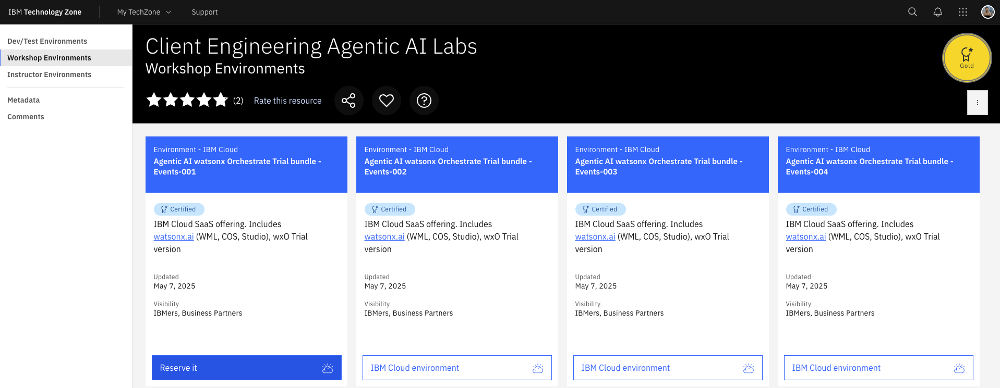
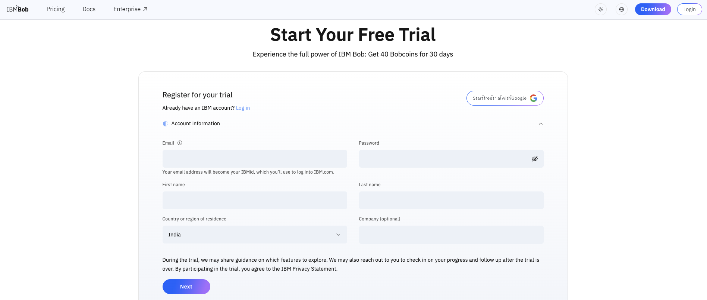
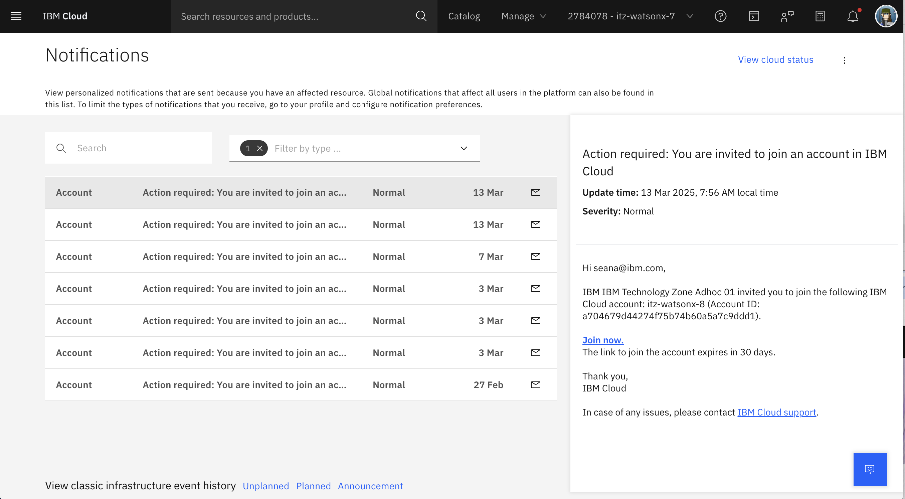
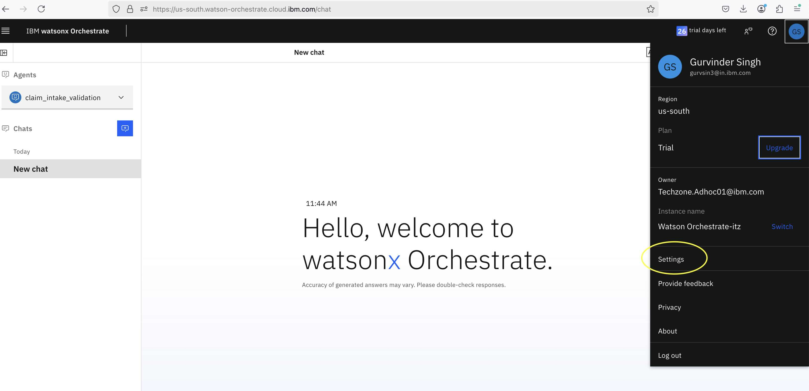
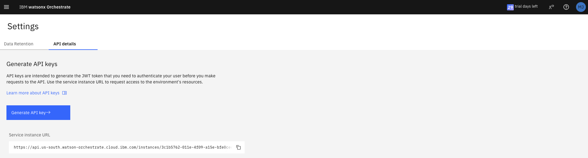
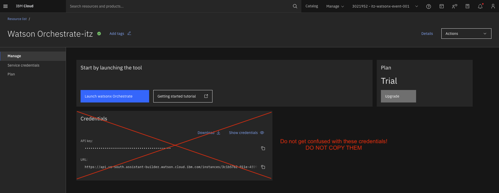

# Lab Environment Setup

Provision and validate all lab environments **at least 12 hours before** the session.

---

## Track 01 Products

This track focuses on:

- [watsonx Orchestrate](https://www.ibm.com/products/watsonx-orchestrate)
- [watsonx.governance](https://www.ibm.com/products/watsonx-governance)
- [IBM Bob](https://bob.ibm.com/)

---

## Environment Details

| Requirement | Detail |
|-------------|--------|
| **Platform** | IBM Cloud TechZone |
| **Accounts needed** | One per attendee |
| **Pre-provisioned resources** | watsonx Orchestrate instances<br>watsonx.governance access<br>IBM Bob |
| **Network** | Stable internet, no restrictive firewall<br>Access to IBM Cloud domains<br>Access to watsonx endpoints |
| **Attendee machine** | Any OS with a modern browser (Chrome/Firefox/Edge)<br>Terminal access for CLI operations |


!!! note "Operating system"
    The Lab commands are built and tested on **MacOS/Linux**. There maybe slight discrepancies with windows powershell or cmd, hence subsystem for linux is recommended if using a windows PC.

---

## Setup Steps

### Step 1: Provision the TechZone Instance

For this pm-launchpad, we have created the [Agentic AI pm-launchpad TechZone bundle](https://ibm.biz/tz-agenticAI-camp){:target="_blank"}, which has all the components needed for the hands-on labs, including:

- watsonx.ai
- Cloud Object Storage (COS) & watsonx.ai Runtime (formerly WML)
- watsonx Orchestrate
- IBM CodeEngine
- watsonx.governance (for the demo)

**Reserve any of the following instance to get started.**



This instance will be valid for maximum of 5 days. Reserve the environment here: [:material-check: Reserve TechZone Instance](https://ibm.biz/tz-agenticAI-camp){ :target="_blank" .md-button .md-button--primary }

!!! note "Important Note!"

    After the Techzone reservation is complete, you will receive an email about it from IBM Techzone. After this, you will receive another email from IBM Cloud inviting you to join a cloud account. Please note, you DO NOT have to create the Cloud account. Techzone reservation will create the account and you DO NOT have to put your credit card anywhere for this.

    Incase you don't have access to the TechZone you most likely don't have and IBM ID. Create an IBM ID by following the instructions here: [Create your IBMid](/facilitator/create-ibm-id/)

### Step 2: Get the free trial of IBM Bob

You can signup for a free 30 days trial of IBM Bob here:



[:material-check: Get IBM Bob](https://bob.ibm.com/trial){ .md-button .md-button--primary }

### Step 3: Access the TechZone Instance

!!! note
    Follow these instructions for accessing your instance of the class environment in order to successfully complete the Agentic AI pm-launchpad.

When you are invited to the class environment, you'll receive an email. This message is from IBM Technology Zone <noreply@techzone.ibm.com> inviting you to join the account where your class environment is located.

In the email, look for the link in the sentence **"Please go HERE to accept your invitation."** (Highlighted in the screenshot below.)


!!! info
    If you miss the email or don't receive it for any reason!

    You can find the invitation on your IBM Cloud account:
    [https://cloud.ibm.com/notifications?type=account](https://cloud.ibm.com/notifications?type=account)

Please select the **Join Now** link.



### Step 4: Setup watsonx Orchestrate ADK locally

!!! note

    Follow these instructions for running wxo-client ADK locally in order to successfully complete the 201 and above labs.

#### Installing the ADK

Install the IBM watsonx Orchestrate ADK on your computer.
​
#### Installation prerequisites

- Install the required software to enable the ADK installation:
    - Python: The programming language that the ADK is written in. The ADK requires at least Python 3.12, and the latest compatible version is Python 3.13. For more information, see Python.
    - Pip: Pip is Python’s package manager. In some operating systems, it’s included with Python’s installation. For more information, see Pip.

- Optional: Create a virtual environment with venv to install the ADK. For more information, see venv Creation of virtual environments.


#### Installing the ADK

- Install the ADK with pip.

    ```
    pip install ibm-watsonx-orchestrate
    ```

- Test the installation:

    ```
    orchestrate --help

    ```

!!! note

    Use the **--help** argument to get information about each command and its arguments in the ADK CLI.

#### Enabling the pm-launchpad environment

- You would need following properties to activate "pm-launchpad" environment:

    - IBM Cloud API Key
    - WXO_INSTANCE_URL (Make sure you copy it from your wxO instance UI under the settings.)

#### Steps to get your wxO instance URL and IBM Cloud API Key

- After login to <https://cloud.ibm.com>, go to resources page by clicking on the left side menu
- Under the **AI/Machine Learning** click on your Watsonx Orchestrate Instance.
- Now, click on **Launch Watsonx Orchestrate** button in blue color.
- This would open wxO instance UI on a new tab.
- On this page, click on your profile image at the top right and then click on **Settings**



- On the **Settings** page, click on the **API Details** tab.
- Copy the Service instance URL, which you need to provide in the above env add command.
- Click on **Generate API key** and create a new API Key.  You would need this key to activate the **pm-launchpad** env.



---

- Run below commands to activate "pm-launchpad" environment and provide your IBM Cloud API Key once asked for the input.

```
orchestrate env add --name pm-launchpad --url <REPLACE_WITH_WXO_INSTANCE_URL> -t ibm_iam
orchestrate env activate pm-launchpad --api-key <YOUR_API_KEY>

```


---

!!! warning "Do not get confused with these credentials and DO NOT COPY THEM!"

    

## Pre-Lab Checklist

Before each lab session, verify:

:material-check: watsonx Orchestrate instance created

:material-check: watsonx.governance instance created

:material-check: IBM Bob is accessible

:material-check: Network connectivity is stable

:material-check: Credentials are prepared and secured

---

## Troubleshooting

Common issues and solutions:

| Issue | Solution |
|-------|----------|
| Cannot access watsonx Orchestrate | Verify IBM Cloud authentication and region |
| Governance policies not loading | Check IAM permissions and policy sync |
| Bob integration failing | Verify network access and authentication tokens |
| API rate limits hit | Implement request throttling or increase limits |

For additional support, see the [Track 01 Troubleshooting Guide](troubleshooting.md).