# Watsonx Orchestrate — Agent Builder Lab Guide

In this lab you're going to be using agent builder to create a simple AI agent that can help brokers in a hypothetical insurance brokerage. This agent will help brokers by providing an agentic chat facility that integrates into the brokerage platform and is embedded into the brokerage UI.

We’ll start by looking at the data model and underlying APIs. For simplicity we are only dealing two entities, Customer and Policy, and they are linked using the customer ID.

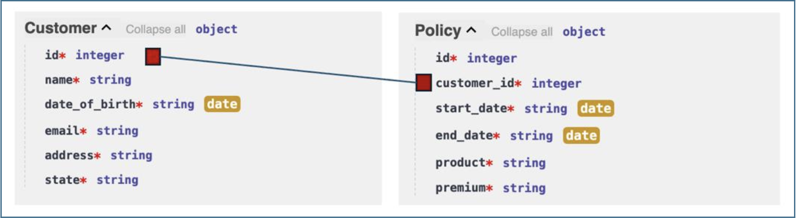

## Pre-requisites

- Make sure you've already setup the environment:
- [Lab Environment setup](/tracks/track-01/lab-environment-setup/)
- [Download files](https://ibm.box.com/s/n0pkqfjzwxi3cvzaq8msaclfnf7mbwro){:target="_blank"}
- Download the zip file from Lab1 folder

## Reference Architecture

1. User sends a natural-language message via the Chat UI or embedded web widget.
2. The LLM analyses the message, plans the required tool calls, and extracts parameters.
3. Orchestrate invokes one or more REST API endpoints on the Insurance backend.
4. Tool results are returned to the LLM, which formats the final response.
5. The formatted response is rendered in the chat interface (table, list, or prose).
6. All interactions are recorded in Agent Analytics as a Trace for observability.

---

## Key Components

This lab has been tested with **watsonx Orchestrate (SaaS)** running on **IBM Cloud**.  
Ensure the following components are available in your environment:

| Component | Description | Example |
|------------|--------------|----------|
| **watsonx Orchestrate** | Used for building and deploying the AI Agent | SaaS - IBM Cloud |
| **Agent Builder** | Interface to configure, test, and deploy the agent | Orchestrate ? Build ? Agent Builder |
| **Customer Service API** | Backend service that provides customer and order data | FastAPI / mock REST API |
| **JSON Tool Files** | OpenAPI specification files used to define tools | `customer-service.json` |
| **Web Integration (Optional)** | HTML page where the chat widget is embedded | `index.html` |
| **LLM (Foundation Model)** | For reasoning and planning during conversations | IBM Granite / Mistral / Meta Llama |
| **Storage (Optional)** | For tracking agent metrics or chat logs | Cloud Object Storage / internal DB |

### Lab Files

| File | Purpose |
|---|---|
| `insurance-services.json`| OpenAPI specification for the Insurance API backend |
| `insurance.html` | Brokerage portal HTML page for web embedding exercise |

---

## Steps

### 1. Explore the Insurance APIs

Before building the agent, familiarise yourself with the API endpoints that will become agent tools.

#### 1.1 Open the API documentation

Navigate to the Insurance API Swagger UI in your browser:

- <https://l4-insurance.1d13bpwyy9q7.us-east.codeengine.appdomain.cloud/docs>


You will see seven GET endpoints grouped under **default**.

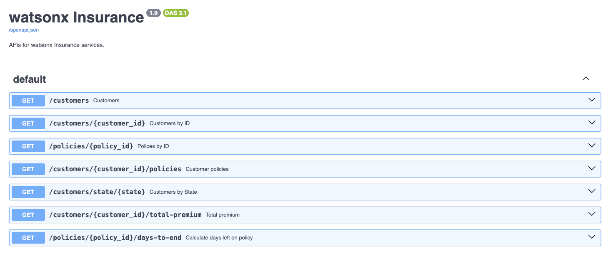

#### 1.2 Test Customers by ID

1. Click **Customers by ID** to expand the section.
2. Click **Try it out**.
3. Enter `2` in the `customer_id` field.
4. Click **Execute**.
5. Scroll down to view the **Response body** — it contains the full customer record for customer 2 (name, DOB, email, address, state).

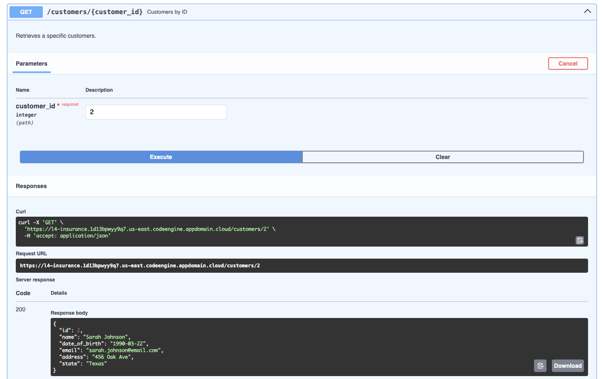

> **Key insight:** To use this endpoint, the agent must parse the customer ID from the user's natural-language request and pass it as a path parameter to the API.

#### 1.3 Test Customer Policies

1. Collapse **Customers by ID**, then expand **Customer policies**.
2. Click **Try it out**, enter `2`, click **Execute**.
3. Scroll to the **Response body** — it shows all policies linked to customer 2 (product, premium, start/end dates).

> **Note:** Policy start and end dates are dynamically regenerated from today's date, so results will differ each run.

#### 1.4 Test the remaining endpoints

Individually test the three remaining operation types:

| Operation | Parameter to use | What it does |
|---|---|---|
| **Customers by State** | `Texas` | Returns all customers in Texas. *Case-sensitive.* |
| **Total premium** | `2` | Returns the sum of all premiums for customer 2. |
| **Calculate days left on policy** | `11` | Returns the number of days until policy 11 expires. |

---

### 2. Create the Agent

#### 2.1 Launch watsonx Orchestrate

1. Open your IBM Cloud service and click **Launch watsonx Orchestrate**.
2. Click the **main menu icon** (top-left hamburger menu).

#### 2.2 Open Agent Builder

1. Expand **Build** in the left navigation panel.
2. Click **Agent Builder**.

#### 2.3 Create a new agent

1. Click **Create agent**.
2. Select **Create from scratch**.
3. Fill in the creation form:

| Field | Value |
|---|---|
| **Name** | `Insurance` |
| **Description** | `This agent retrieves information about customers and their policies` |

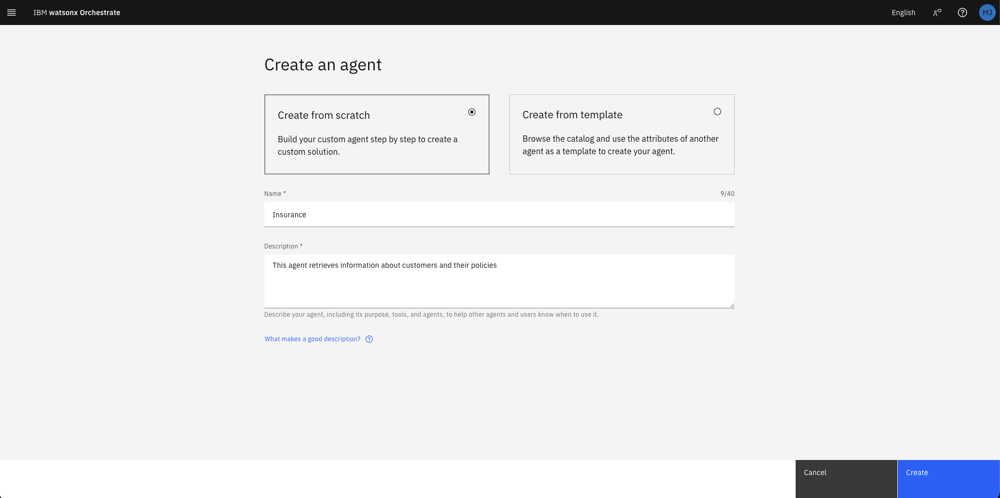

4. Click **Create**.

The Agent Builder workspace opens with three key areas:

| Area | Description |
|---|---|
| **Navigation Panel** (left) | Switch between Profile, Knowledge, Toolset, Behavior, Channels |
| **Configuration** (centre) | Set up and customise the agent |
| **Preview** (right) | Live test the agent during development |

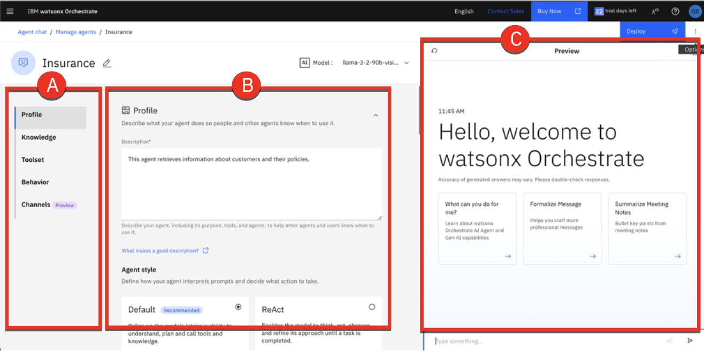

Below is a description of each section:

- **Profile:** Define your agents purpose, usage scenarios, and interaction style. Describe what the agent does, when it should be used (especially in multi-agent configurations), and choose its style Default or ReAct guide how it interprets requests, plans, and uses tools.

- **Knowledge:** Equip your agent with knowledge by uploading files or connecting to conversational search platforms such as Milvus, Elasticsearch, or custom-built sources. This ensures the agent can generate accurate, contextual responses by drawing on relevant content.

- **Toolset:** Provide your agent with tools to perform tasks. Tools can be added from the Catalog, imported from OpenAPI specification files or MCP servers, or built with custom flows. Tools extend the agents capabilities, enabling it to automate actions such as retrieving data or sending emails.

- **Behavior:** Define how the agent interacts with users, formats data, and handles requests. Add rules and instructions to shape its tone, response style, and overall behavior during interactions.

- **Channels:** Connect your agent to communication platforms like Slack or embed it in a website.

---

### 3. Import API Tools

#### 3.1 Open the Toolset

Click **Toolset** in the left navigation panel.

#### 3.2 Add a new tool

1. Click **Add tool**.
1. Click **OpenAPI**.

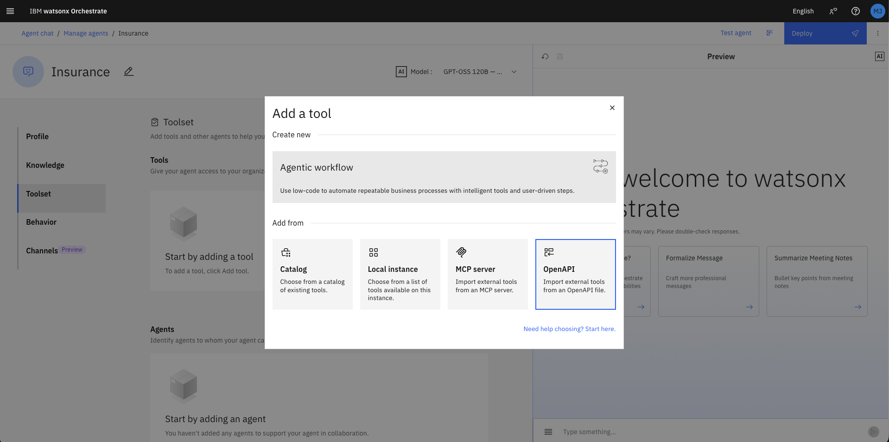

#### 3.3 Upload the OpenAPI specification

1. Drag and drop (or browse to) the `insurance-services.json` file you downloaded earlier.
2. Wait for the *Validation successful* confirmation.

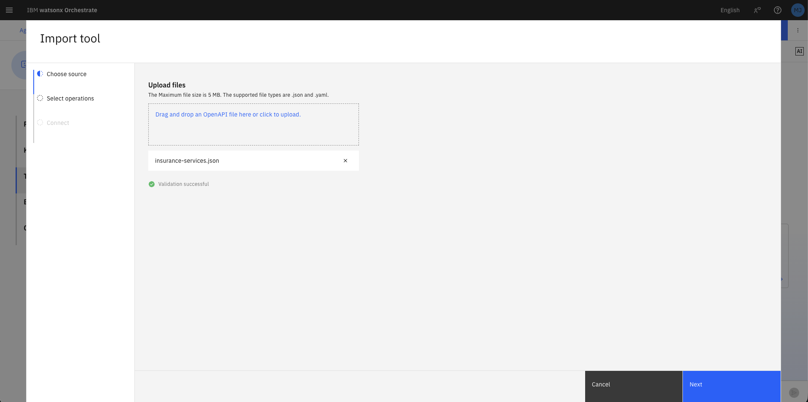

3. Click **Next**.

> The `insurance-services.json` file is an OpenAPI 3.1.0 specification. Orchestrate parses it to extract tool names, descriptions, input parameters, and output schemas automatically. See [openapis.org](https://www.openapis.org/what-is-openapi) for further details on the OAS format.

#### 3.4 Select operations

From the list of 7 operations, **select all except Total premium**, then click **Done**.

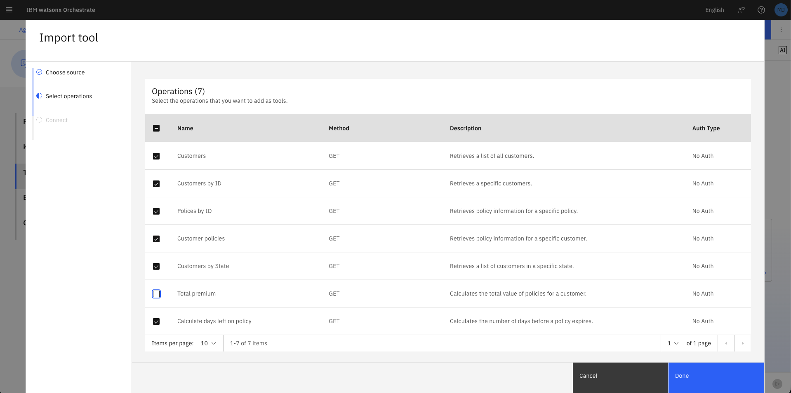

| Operation | Import now? |
|---|---|
| Customers | ✅ Yes |
| Customers by ID | ✅ Yes |
| Policies by ID | ✅ Yes |
| Customer policies | ✅ Yes |
| Customers by State | ✅ Yes |
| **Total premium** | ❌ **No — skip for now** |
| Calculate days left on policy | ✅ Yes |

> `Total premium` is excluded deliberately. You will add it later to compare LLM-only aggregation (unreliable) versus tool-assisted aggregation (deterministic).

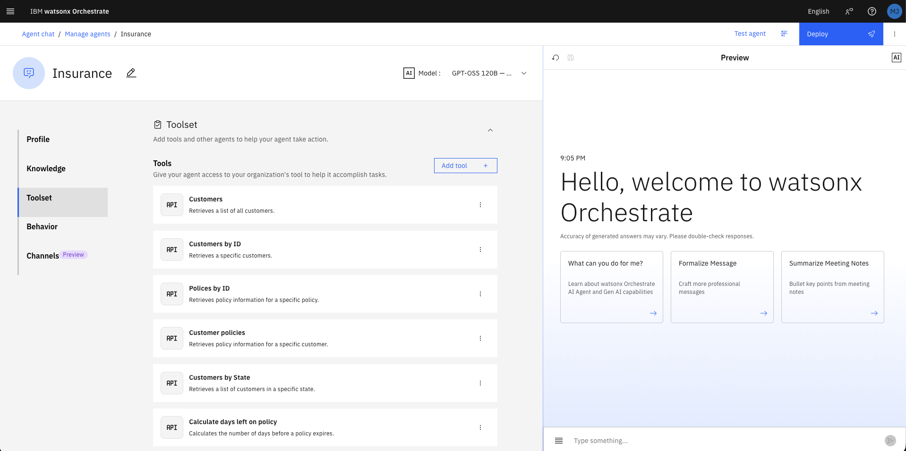

#### 3.5 Review an imported tool

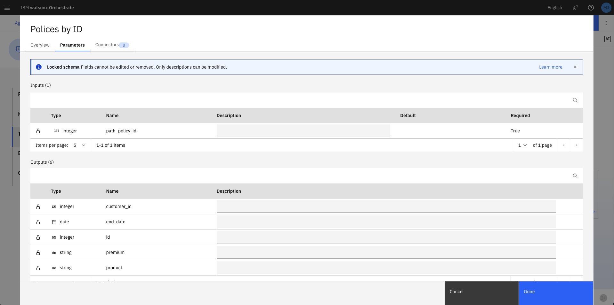

1. Click the **three dots (⋮)** on the **Policies by ID** tool row.
2. Click **Edit details**.
3. Note that the tool **Description** has been auto-populated from the OpenAPI spec — this is what the LLM uses to decide *when* to call this tool.
4. Select the **Parameters** to review **Inputs** (requires `path_policy_id`, integer) and **Outputs** (returns `id`, `premium`, `product`, `end_date`, `start_date`).
5. Click **Cancel**.

> **Best practice:** Avoid tools with similar descriptions or overlapping responsibilities. Clear, distinct descriptions improve the agent's tool selection accuracy.

---

### 4. Basic Tool Usage

#### 4.1 Query a specific policy

In the **Preview** panel (right side), type the following and press **Enter**:

```
show me the details for policy 3
```

Observe how the agent:
- Identifies the correct tool (`Policies by ID`)
- Extracts `3` as the `policy_id` parameter
- Calls the API and returns the formatted result

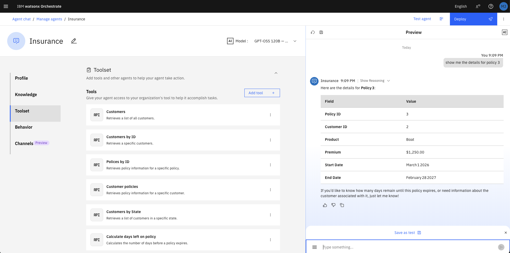

#### 4.2 List all customers by adding improved output formatting instruction

1. Click **Behavior** in the left navigation panel.
2. In the **Instructions** field, enter:

```
When showing a list of customers present the data in a table.
```

3. Type the following in the **Preview** panel:

```
show me my customers
```

The data is returned in a Markdown table. Note that all 13 customers are shown, which may overflow the screen.

#### 4.3 Limit results inline

Type the following in the **Preview** panel:

```
show me my customers but only show the first 5
```

Orchestrate calls the same `Customers` tool (which returns all records) but the LLM truncates the display to the first 5 rows as instructed — no API change required.

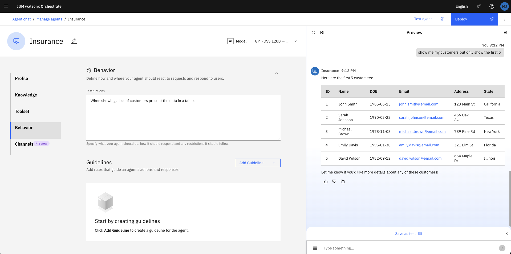

---

### 5. Filtering

#### 5.1 Filter by a single state

In the **Preview** panel, type:

```
show me my customers from Texas
```

Click **Show Reasoning** on the response, then expand **Step 1** to confirm:
- **Tool used:** `customers_by_state`
- **Input:** `{ "state": "Texas" }`
- **Output:** JSON array of Texas customers

> **Key insight:** The agent chose the targeted `Customers by State` tool rather than fetching all customers and filtering client-side. This is more efficient and avoids overloading the agent's context window with unnecessary data.

#### 5.2 Filter by multiple states

1. Click the **reset icon** (↺) in the Preview panel to clear conversation history.
2. Type:

```
show me my customers from Texas and Florida
```

Click **Show Reasoning** — expand **Step 1** and **Step 2**:
- Step 1: Tool `customers_by_state` called with `"state": "Texas"`
- Step 2: Tool `customers_by_state` called with `"state": "Florida"`
- Results from both calls are merged into a single response table.


#### 5.3 Demonstrate context memory (case correction)

Without resetting, type:

```
just show me my customers from florida
```

Note the lowercase `florida`. Because the prior conversation already contained the correctly capitalised response for Florida, the agent filters from memory — no additional tool call is needed.

Now **reset** the chat and repeat the same lowercase query. This time:
- The agent must call the API fresh
- It may or may not correct capitalisation to `Florida` depending on LLM behaviour
- If it submits `florida` (lowercase) to the case-sensitive API, it returns zero results

> **Design implication:** Do not rely on LLM case correction for case-sensitive APIs. The correct solution is to make the API case-insensitive, or to add an instruction/validator that normalises state input before the tool call.

---

### 6. Aggregation

This section demonstrates why tools should be used for calculations rather than relying on the LLM.

#### 6.1 Aggregation with conversational context (accurate)

1. Reset the chat.
2. Type:

```
show me the policies for customer 2
```

3. After the table appears, type:

```
sum the policy premiums
```

The agent will correctly sum the premiums (e.g., $3,730.00) because the policy data is already in the conversation history — the LLM can "see" the numbers and sum them reliably in this context.

#### 6.2 Aggregation without context (unreliable)

1. Reset the chat.
2. Type directly:

```
calculate the sum of all policy premiums for customer 2
```

The agent calls `customer_policies` to fetch the data, then attempts to sum the premiums itself. Results may be $2,730, $2,830, or $3,730 — the LLM is a text generator, not a calculator, and is prone to arithmetic errors, especially when multiple currency-like fields (premium, excess, tax) exist in the output.

> **Key lesson:** Always use a dedicated calculation tool for deterministic numeric operations. LLM-based arithmetic is non-deterministic and should not be used in production for financial data.

#### 6.3 Add the Total premium tool

1. Click **Toolset**, then **Add tool**.
2. Click **Add from file or MCP server** → **Import from file**.
3. Upload `insurance-services.json` again, click **Next**.
4. This time, select **only Total premium**, then click **Done**.

#### 6.4 Add a tool-use instruction

1. Click **Behavior**.
2. Append the following to the **Instructions** field:

```
When asked to calculate the total value of all policies for a customer always use the "Total premium" tool.
```

#### 6.5 Re-run with the new tool

1. Reset the chat.
2. Type:

```
calculate the sum of all policy premiums for customer 2
```

3. Click **Show Reasoning** → expand **Step 1**.

Confirm:
- **Tool used:** `total_premium`
- **Input:** `{ "customer_id": "2" }`
- **Output:** `{ "customer_id": 2, "total_premium": 3730 }`
- **Result displayed:** The sum of all policy premiums for customer 2 is 3730. ✅

---

### 7. Context and Multi-Step Reasoning

This section demonstrates how the agent uses conversation history to resolve ambiguous references.

#### 7.1 Set up context

1. Reset the chat.
2. Type:

```
show me my customers from Texas
```

A table of Texas customers appears (including Sarah Johnson, ID 2).

#### 7.2 Follow-up with a name reference

Type:

```
just show me details for Sarah
```

Click **Show Reasoning** → expand **Step 1**:
- **Tool:** `customers_by_id`
- **Input:** `{ "customer_id": "2" }`

The agent inferred Sarah's ID from the prior conversation — no explicit ID was provided.

#### 7.3 Multi-step policy analysis

Type:

```
Fetch Sarah's policies, show me any policies that end within the next 30 days
```

Click **Show Reasoning** — observe that **4 tool calls** were required:

| Step | Tool | Purpose |
|---|---|---|
| Step 1 | `customer_policies` | Fetch all of Sarah's policies (using ID 2 from context) |
| Step 2 | `calculate_days_left_on_policy` | Check days remaining for policy A |
| Step 3 | `calculate_days_left_on_policy` | Check days remaining for policy B |
| Step 4 | `calculate_days_left_on_policy` | Check days remaining for policy C |

The agent then filters and displays only policies expiring within 30 days.


> **Design implication:** Without prior context (Sarah's ID in memory), the agent may attempt a full customer scan to find "Sarah" — which is inefficient and fragile in datasets with many customers sharing the same first name. Design your data model and tool set to minimise ambiguous lookups.

---

### 8. Web Integration

Embed the agent into the provided brokerage HTML portal.

#### 8.1 Get the embed script

1. Click **Channels** in the left navigation panel.
2. Click **Embedded agent**.
3. Click the **copy icon** to copy the JavaScript snippet to your clipboard.


#### 8.2 Edit the HTML file

1. Open `insurance.html` in a text editor (VS Code, Sublime Text, or similar — **not** a word processor).
2. Scroll to the bottom of the file. Locate the marker comment at lines 504–507:

```html
<!-- Add the orchestrate script below this line  -->

<!-- The orchestrate script must be above this line -->
```

3. Place your cursor on the blank line between the two comments (line 506).
4. Paste the copied script. The result should look like:

```html
<!-- Add the orchestrate script below this line  -->
<script>
  window.wxOConfiguration = {
    orchestrationID: "...",
    hostURL: "https://us-south.watson-orchestrate.cloud.ibm.com",
    rootElementID: "root",
    deploymentPlatform: "ibmcloud",
    crn: "crn:v1:bluemix:public:watsonx-orchestrate:us-south:...",
    chatOptions: {
      agentId: "...",
    }
  };
  setTimeout(function () {
    const script = document.createElement('script');
    script.src = `${window.wxOConfiguration.hostURL}/wxochat/wxoLoader.js?embed=true`;
    script.addEventListener('load', function () { wxoLoader.init(); });
    document.head.appendChild(script);
  }, 0);
</script>
<!-- The orchestrate script must be above this line -->
```

5. **Save** the file and close the editor.

#### 8.3 Open in a browser

Right-click `insurance.html` and open with your browser (Chrome recommended).

A chat icon appears in the **lower-right corner** of the brokerage portal.


#### 8.4 Test the embedded agent

Click the chat icon to open the widget, then type:

```
Show me the policies for customer 2, just display the policy id, product and premium
```

The agent retrieves and displays a focused table with only the three requested columns — confirming the embedded agent has full access to all configured tools.

---

### 9. Agent Deployment

Deploy the agent to make it available in the Orchestrate Chat UI for all users.

#### 9.1 Initiate deployment

1. Click **Deploy** (top-right button in Agent Builder).
2. Review the **Pre-deployment summary** — it shows the agent's profile, knowledge sources, tools (7), collaborators, and behaviour configuration.
3. Click **Deploy** to confirm.

#### 9.2 Confirm deployment

A green **Success — You have deployed Insurance** notification appears. The Channels panel now shows both **Draft** and **Live** states for the Embedded agent.


#### 9.3 Use the deployed agent in Chat

1. Open the **main menu** and click **Chat**.
2. Click the **arrow** next to the current agent name (top-left) to open the agent picker.
3. Select **Insurance**.
4. In the chat window, type:

```
Show me the policies for customer 2, just display the policy id, product and premium
```

The Insurance agent responds with a correctly formatted policy table — confirming the live deployment is working.

---

### 10. Agent Analytics

Review usage data and inspect execution traces.

#### 10.1 Navigate to analytics

1. Open the **main menu** → **Build** → **Agent Builder**.
2. Click **View all** (top-right of the agent grid) to open the Agent Analytics dashboard.

The dashboard shows aggregate metrics across all agents:
- **Total messages**
- **Failed messages**
- **Latency average (ms)**

#### 10.2 Filter to the Insurance agent

1. In the **Agents** search field, type `Insurance`.
2. Click **Insurance** in the results table to open its analytics detail page.

You will see per-agent metrics and a **Traces** table listing every conversation session with timestamp, trace ID, status, model, and latency.


#### 10.3 Inspect a trace

1. Click the **top row** in the Traces table (your most recent conversation).
2. The **Trace Detail** panel opens, showing a Gantt-style timeline of every operation in the LangGraph workflow, including:
   - `agent_style_router.task`
   - `agent.task` → `invoke_agent.task`
   - `ChatPromptTemplate.task`
   - `WatsonxChatModel.chat` (LLM inference)
   - `tools.task` → `POST` (API tool call)
   - `answer.task`

3. Click the row for the last **WatsonxChatModel.chat** operation.
4. Click **Tags** to expand the span details.
5. Scroll down to view:

| Field | Description |
|---|---|
| `gen_ai.completion.0.content` | The final formatted response returned by the LLM |
| `gen_ai.prompt.0.content` | The system prompt content (agent role definition) |
| `gen_ai.prompt.1.content` | User message |
| `gen_ai.prompt.2.tool_calls.0.arguments` | Arguments passed to the tool |

You can also see the **agent instructions** (Behavior section content) and the **current date** injected into the system prompt at runtime.


> **Production tip:** Use the Traces view to debug unexpected agent behaviour — you can inspect exactly what prompt was sent, which tools were called, what data was returned, and how the final response was generated.

---

## Summary

By completing this lab you have:

- ✅ Explored a live REST API and understood its data model
- ✅ Created an AI agent from scratch using Agent Builder
- ✅ Imported API tools from an OpenAPI specification file
- ✅ Used behavioral instructions to control response formatting and tool preference
- ✅ Demonstrated intelligent filtering using the correct API endpoint (not client-side scan)
- ✅ Compared LLM-based aggregation (unreliable) versus tool-based aggregation (deterministic)
- ✅ Leveraged conversation context for multi-step, multi-tool agentic reasoning
- ✅ Embedded the agent into a standalone web page using a JavaScript snippet
- ✅ Deployed the agent to the Orchestrate Chat interface
- ✅ Inspected execution traces in the Agent Analytics dashboard

These skills provide a solid foundation for building production-grade agents in the IBM watsonx Orchestrate ecosystem.

---

*For the source lab files, visit: [github.com/IBM/wxo-l4-assets](https://github.com/IBM/wxo-l4-assets)*
