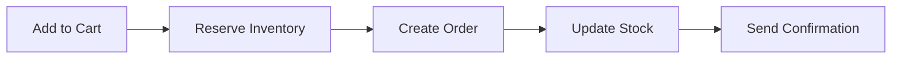

# Lab Guide: E-Commerce Product Catalog

!!! warning "Placeholder"
    Fill in product-specific implementation steps before running this track.

Follow this guide to build your e-commerce product catalog solution.

---

## Step 1: Set Up Product Data Model

Create the foundational data structure for your product catalog.

### Tasks

1. Define product schema with required attributes
2. Create category hierarchy structure
3. Set up product-category relationships
4. Configure product attributes (size, color, price, etc.)

### Implementation

```yaml
# Example product schema
Product:
  id: string
  name: string
  description: text
  category_id: string
  price: decimal
  sku: string
  attributes: object
  images: array
  created_at: timestamp
```

??? example "Expected Output"
    ```
    Product schema created successfully
    - 5 product categories defined
    - Product attributes configured
    - Sample products imported
    ```

---

## Step 2: Configure Multi-Warehouse Inventory

Set up inventory tracking across multiple warehouse locations.

### Tasks

1. Define warehouse locations
2. Create inventory tracking system
3. Set up stock level monitoring
4. Configure low-stock alert thresholds

### Implementation

```yaml
# Example inventory schema
Inventory:
  product_id: string
  warehouse_id: string
  quantity: integer
  reserved: integer
  available: integer
  last_updated: timestamp
```

??? example "Expected Output"
    ```
    Inventory system configured
    - 3 warehouse locations added
    - Stock levels synchronized
    - Alert thresholds set at 10 units
    ```

---

## Step 3: Build Product Search & Browse Interface

Create customer-facing product discovery features.

### Tasks

1. Implement product search functionality
2. Create category browsing interface
3. Add filtering and sorting options
4. Display real-time availability

### Key Features

- Full-text product search
- Category-based navigation
- Filter by price, attributes, availability
- Sort by relevance, price, popularity

??? example "Expected Output"
    ```
    Search interface deployed
    - Search returns relevant results in <100ms
    - Category navigation functional
    - Filters working correctly
    - Real-time availability displayed
    ```

---

## Step 4: Implement Order Processing Workflow

Create basic order management with inventory reservation.

### Tasks

1. Build shopping cart functionality
2. Implement inventory reservation on order
3. Create order status tracking
4. Set up order confirmation system

### Workflow



??? example "Expected Output"
    ```
    Order processing active
    - Orders created successfully
    - Inventory reserved automatically
    - Stock levels update in real-time
    - Confirmation emails sent
    ```

---

## Validation & Testing

### Test Scenarios

1. **Product Search**
   - Search for products by name
   - Filter by category and price
   - Verify search results accuracy

2. **Inventory Management**
   - Check stock levels across warehouses
   - Verify low-stock alerts trigger
   - Test inventory reservation on order

3. **Order Processing**
   - Create test orders
   - Verify inventory updates
   - Check order status tracking

### Success Criteria

- ✅ All products searchable and browsable
- ✅ Inventory levels accurate across all warehouses
- ✅ Orders process correctly with inventory updates
- ✅ Real-time availability displayed to customers

---

## Troubleshooting

Common issues and solutions:

| Issue | Solution |
|-------|----------|
| Search returns no results | Check index configuration and data import |
| Inventory not updating | Verify API connections and webhook setup |
| Orders failing | Check inventory reservation logic |

For additional help, refer to the [Troubleshooting Guide](../../../troubleshooting.md).

---

## Next Steps

Congratulations! You've completed the E-Commerce Product Catalog use case.

- Review key concepts and architecture decisions
- Explore [Use Case 2: Omnichannel Inventory](../use-case-2/details.md)
- Continue to Lab 201 for advanced features
- Share your experience with the facilitator

!!! success "Well Done!"
    You've successfully built a modern product catalog system with real-time inventory tracking and customer-facing interfaces.