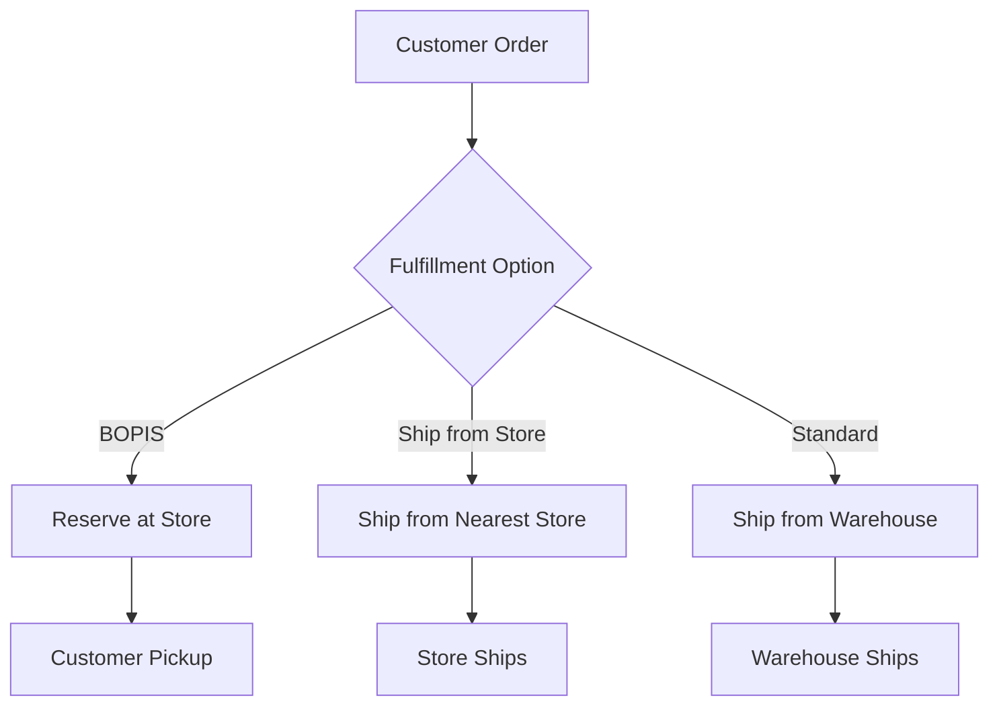

# Lab Guide: Omnichannel Inventory Management

!!! warning "Placeholder"
    Fill in product-specific implementation steps before running this track.

Follow this guide to build your omnichannel inventory management solution.

---

## Step 1: Set Up Multi-Location Inventory System

Create a unified inventory platform that tracks stock across all locations.

### Tasks

1. Define location types (stores, warehouses, distribution centers)
2. Create inventory tracking schema
3. Set up real-time synchronization
4. Configure location hierarchies

### Implementation

```yaml
# Example location schema
Location:
  id: string
  name: string
  type: enum [store, warehouse, distribution_center]
  address: object
  capacity: integer
  active: boolean

# Example inventory schema
Inventory:
  product_id: string
  location_id: string
  quantity_on_hand: integer
  quantity_reserved: integer
  quantity_available: integer
  reorder_point: integer
  reorder_quantity: integer
  last_sync: timestamp
```

??? example "Expected Output"
    ```
    Multi-location inventory configured
    - 10 store locations added
    - 2 warehouse locations added
    - Real-time sync enabled
    - Location hierarchies defined
    ```

---

## Step 2: Implement Automated Reordering Logic

Set up intelligent reordering based on stock levels and demand patterns.

### Tasks

1. Configure reorder points for each product-location
2. Create automated purchase order generation
3. Set up supplier integration
4. Implement approval workflows

### Reordering Logic

```python
# Pseudocode for reorder logic
if quantity_available <= reorder_point:
    create_purchase_order(
        product_id=product_id,
        quantity=reorder_quantity,
        supplier_id=preferred_supplier,
        delivery_location=location_id
    )
    send_notification(purchasing_team)
```

??? example "Expected Output"
    ```
    Automated reordering active
    - Reorder points configured for 150 products
    - Purchase orders auto-generated
    - Supplier notifications sent
    - Approval workflow functional
    ```

---

## Step 3: Build Store Fulfillment Capabilities

Enable omnichannel fulfillment options for customers.

### Tasks

1. Implement BOPIS (Buy Online, Pick up In Store)
2. Create ship-from-store functionality
3. Set up store-to-store transfer workflows
4. Build customer notification system

### Fulfillment Options



??? example "Expected Output"
    ```
    Fulfillment options enabled
    - BOPIS available for all stores
    - Ship-from-store configured
    - Store transfers automated
    - Customer notifications active
    ```

---

## Step 4: Create Analytics Dashboard

Build visibility into inventory performance and trends.

### Tasks

1. Create real-time inventory dashboard
2. Implement stock level alerts
3. Build turnover rate reports
4. Set up demand forecasting

### Key Metrics

- **Stock Levels:** Current inventory by location
- **Turnover Rate:** How quickly inventory sells
- **Stockout Rate:** Frequency of out-of-stock situations
- **Excess Inventory:** Slow-moving or obsolete stock
- **Forecast Accuracy:** Predicted vs. actual demand

??? example "Expected Output"
    ```
    Analytics dashboard deployed
    - Real-time inventory visibility
    - Automated alerts configured
    - Turnover reports generated
    - Demand forecasts calculated
    ```

---

## Validation & Testing

### Test Scenarios

1. **Multi-Location Sync**
   - Update inventory at one location
   - Verify sync across all systems
   - Check real-time accuracy

2. **Automated Reordering**
   - Reduce stock below reorder point
   - Verify purchase order creation
   - Check supplier notifications

3. **Omnichannel Fulfillment**
   - Place BOPIS order
   - Test ship-from-store
   - Verify store transfer workflow

### Success Criteria

- ✅ Inventory syncs in real-time across all locations
- ✅ Automated reordering prevents stockouts
- ✅ All fulfillment options working correctly
- ✅ Analytics provide actionable insights

---

## Troubleshooting

Common issues and solutions:

| Issue | Solution |
|-------|----------|
| Sync delays | Check network connectivity and API rate limits |
| Reorder not triggering | Verify reorder points and logic configuration |
| BOPIS unavailable | Check store inventory and reservation system |

For additional help, refer to the [Troubleshooting Guide](../../../troubleshooting.md).

---

## Next Steps

Congratulations! You've completed the Omnichannel Inventory Management use case.

- Review key concepts and architecture decisions
- Explore [Use Case 1: E-Commerce Product Catalog](../use-case-1/details.md)
- Continue to Lab 201 for advanced features
- Share your experience with the facilitator

!!! success "Well Done!"
    You've successfully built an omnichannel inventory management system with automated reordering and multi-location fulfillment capabilities.