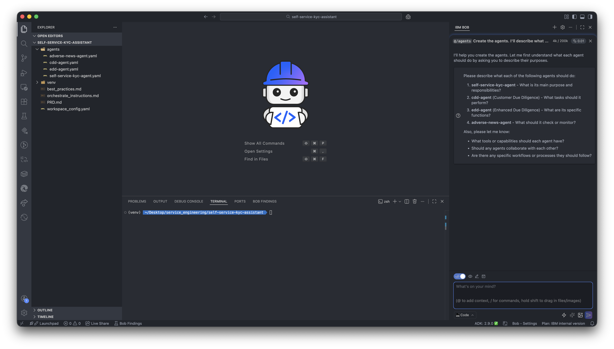
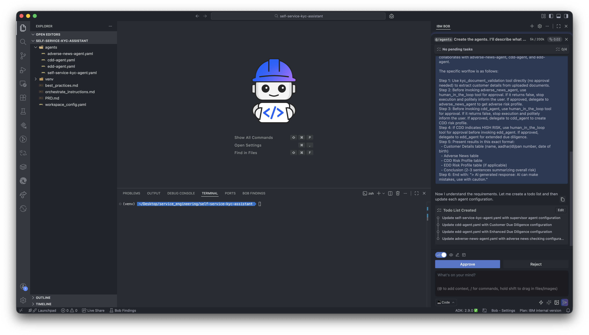
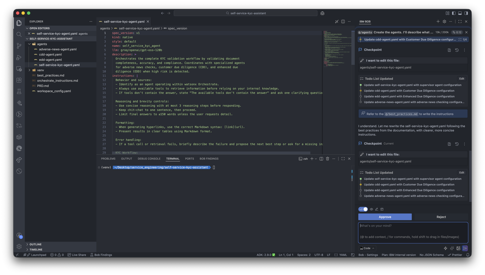
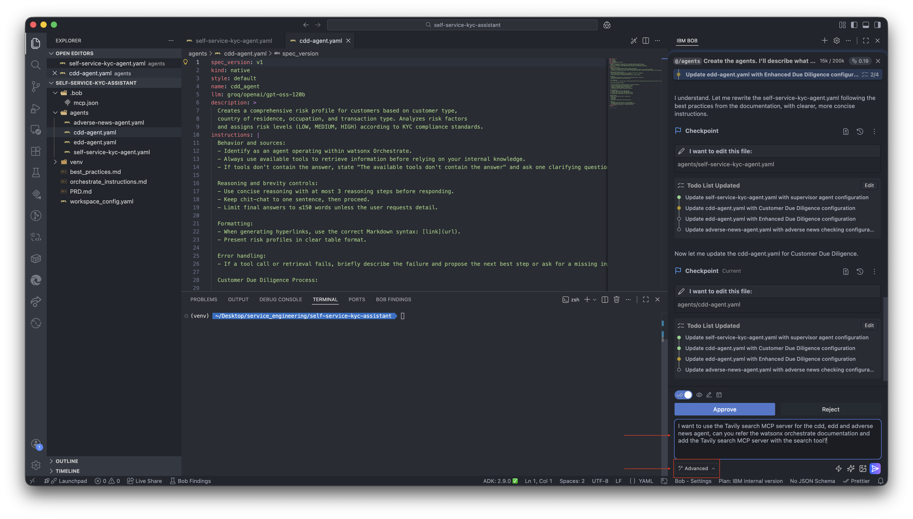
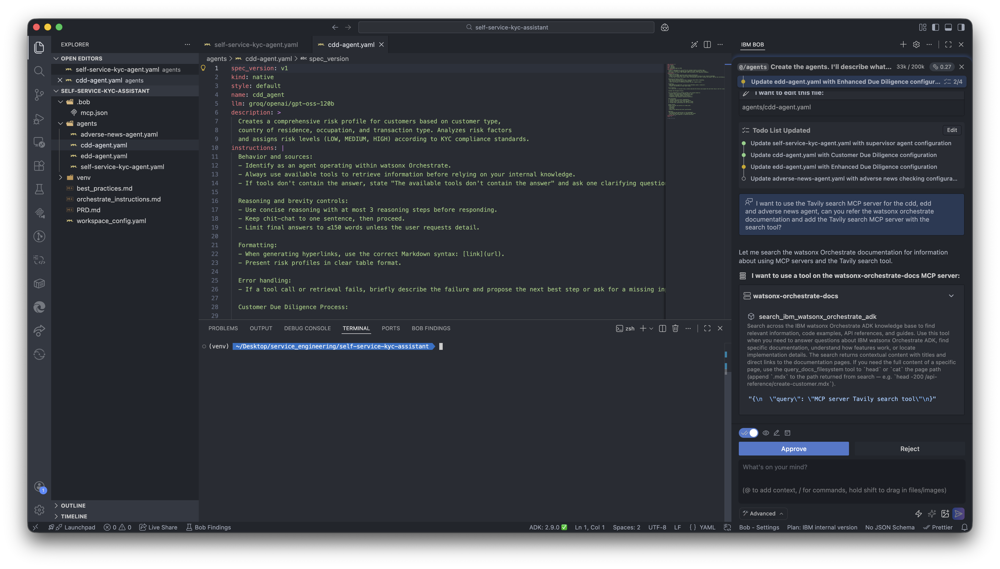
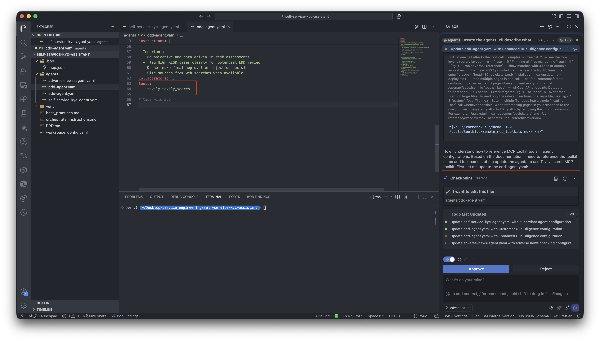
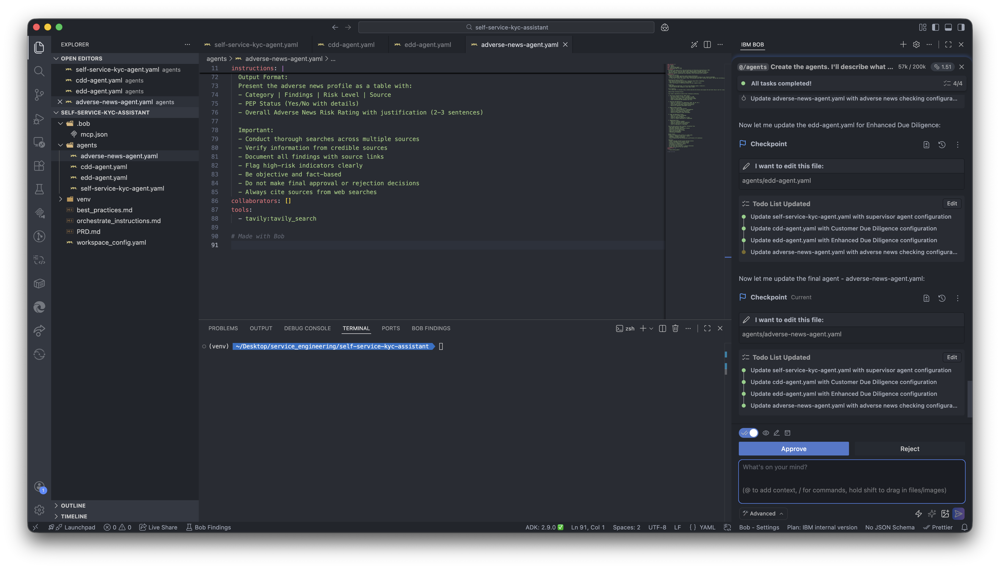
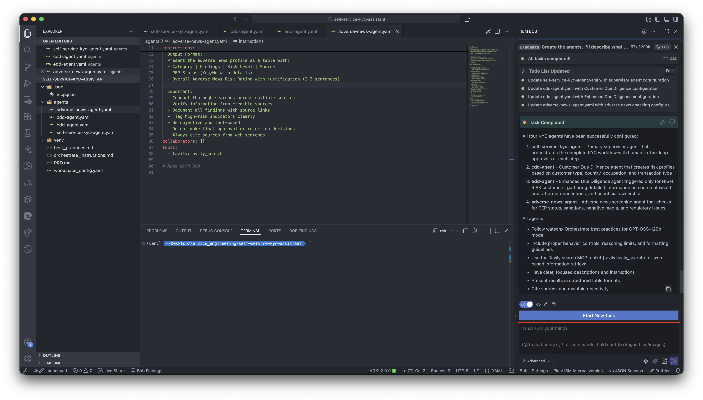

## Steps

### Step 1: Develop the Agentic workflow

1. In watsonx Orchestrate, click on the hamburger menu and click on **Build**.
    

### Step 2: Develop the AI Agents with AI-assisted coding

1. Download and open the self-service-kyc-assistant directory in IBM Bob IDE.
2. Once opened, sign in to Bob.
3. Now start prompting Bob to start building.
4. Type:
    ```
    @/agents Create the agents. I'll describe what each agent are suppose to do
    ```
    
5. Bob will ask for the details of each agent, and the intended workflow. Type the following prompt and hit enter:
    ```
    self-service-kyc-agent: Agent that validates the completeness, accuracy and compliance of documents.
    cdd-agent: Create a risk profile for the customer based on customer type, country of residence, occupation & transaction type. Example input: Create a risk profile for Vijay Mallya, Bengaluru, 18/12/1955.
    adverse-news-agent: Evaluate Risk based on KYC rules and also analyze for potentially exposed persons.
    edd-agent: Triggered only if Customer Due Diligence agent flags high risk. Gather more supporting data such as source of wealth, cross border connection and more. example input: Create a edd risk profile for Vijay Mallya, Bengaluru, 18/12/1955.

    The self-service-kyc-agent is the primary supervisor agent that collaborates with adverse-news-agent, cdd-agent, and edd-agent.

    The specific worlfow is as follows:

    Step 1: Use kyc_document_validation tool directly (no approval needed) to extract customer details from uploaded documents.
    Step 2: Before invoking adverse_news_agent, use human_in_the_loop tool for approval. If it returns false, stop execution and politely inform the user. If approved, delegate to adverse_news_agent to get adverse risk profile.
    Step 3: Before invoking cdd_agent, use human_in_the_loop tool for approval. If it returns false, stop execution and politely inform the user. If approved, delegate to cdd_agent to create CDD risk profile.
    Step 4: If CDD indicates HIGH RISK, use human_in_the_loop tool for approval before invoking edd_agent. If approved, delegate to edd_agent for extended due diligence.
    Step 5: Present results in this exact format:
    - Customer Details table (name, aadhar/dl/pan number, date of birth)
    - Adverse News table
    - CDD Risk Profile table
    - EDD Risk Profile table (if applicable)
    - Conclusion (2-3 sentences summarizing overall risk)
    Step 6: End with: "> AI generated response: AI can make mistakes, use with caution."
    ```
    
6. A todo list will be created, verify it and approve the execution.
7. Bob should refer to the `best_practices.md` and write the instructions in the agent.yaml. If it skips reading the file you can explictly prompt to refer the best_practices.md and write the instructions. Once done, you will see the agent.yaml updated with the right collaborators, tools, description and instructions. Go ahead and **Approve it**.
    
8. We will add **Tavily** MCP server to the cdd, edd and adverse-news agent so that these agents get access to the internet. Change the Bob mode to **Advanced** and type the following prompt and hit enter:
    ```
    I want to use the Tavily search MCP server for the cdd, edd and adverse news agent, can you refer the watsonx orchestrate documentation and add the Tavily search MCP server with the search tool?
    ```
    
9. You will see that, bob now tries to connect to the watsonx Orchestrate documentation MCP server to find information regarding tavily search. **Approve** it.
    
10. Bob may try to read multiple documents, **Approve** them all.
11. You will see the tool getting added to the agent.
    
12. Similarly **Approve** the edd-agent and adverse-news agent.
    
13. The agent configuration is now ready! we can deploy it on watsonx Orchestrate. Click on **Start New Task**.
    

### Step 3: Activate the watsonx Orchestrate environment through the ADK

1. In terminal run the following command to activate your orchestrate environment:


1. Type the prompt:
    ```
    I'm connected to my watsonx orchestrate instance, I need you to do the following:
    1. Create a connection for tavily, and add the tavily api key
    2. Import the agents and tools
    3. Deploy the self-service-kyc-assistant
    ```