# Lab guide for IT Service Manager

## Overview

In this lab, you will configure and deploy a pre-built IT Service Manager agent that integrates with ServiceNow to handle incident management, ticket creation, task assignment, and knowledge base access. This agent enables employees to interact with IT services through natural language, streamlining support operations and improving response times.

## Pre-requisites

- Make sure you've already setup the environment:
- [Lab Environment setup](../../../../lab-environment-setup.md)
- Access to watsonx Orchestrate
- ServiceNow instance with ITSM module enabled
- ServiceNow credentials with appropriate permissions
- Basic understanding of ITSM concepts

## Reference Architecture

The IT Service Manager follows an integrated architecture:

1. **User Interface Layer:** Chat interface where employees submit IT requests and check ticket status
2. **Agent Layer:** watsonx Orchestrate agent that processes requests and orchestrates ServiceNow operations
3. **Integration Layer:** ServiceNow REST API connections for ITSM operations
4. **ServiceNow Platform:** Backend ITSM system managing incidents, tasks, and knowledge base

**Key Components:**

- **IT Service Manager Agent:** Pre-built agent from watsonx Orchestrate catalog
- **ServiceNow Connector:** Authenticated connection to ServiceNow instance
- **ServiceNow Tools:** Create, update, retrieve, and close incidents

## ServiceNow OAuth 2.0 Setup Guide

### Quick Reference — All Fields

| Field | Value |
|---|---|
| **Base URL / Server URL** | `https://<your-instance>.service-now.com` |
| **Authorization URL** | `https://<your-instance>.service-now.com/oauth_auth.do` |
| **Token URL** | `https://<your-instance>.service-now.com/oauth_token.do` |
| **Client ID** | From ServiceNow Application Registry |
| **Client Secret** | From ServiceNow Application Registry |
| **Scopes** | `useraccount` |
| **Callback URL** | `https://{{region}}.watson-orchestrate.cloud.ibm.com/mfe_connectors/api/v1/agentic/oauth/_callback` |

### Steps

1. Log in to Your ServiceNow Instance

    | | |
    |---|---|
    | **Instance URL** | `https://<your-instance>.service-now.com` |
    | **Login with** | Your ServiceNow admin credentials |

    > **Note:** You need admin privileges to create OAuth application registry entries.

2. Navigate to Machine Identity Console

    | | |
    |---|---|
    | **Go to** | All → Machine Identity Console (or search in navigator) |
    | **Click** | Inbound Integrations tab |
    | **Click** | 'New Integration' button (top right) |

    > **Note:** Alternatively, search for 'Application Registry' in the navigator for the classic view.

3. Select Connection Type

    | | |
    |---|---|
    | **Select** | `OAuth - Authorization code grant` |
    | **Description** | Used for interactive user authorization to obtain consent for accessing the application with user context |
    | **Do NOT select** | Client credentials grant (machine-to-machine, no user context) |

    > **Note:** Authorization code grant is required because watsonx Orchestrate connects on behalf of a user (3-legged OAuth).

4. Fill in the New Record Form

    | | |
    |---|---|
    | **Name** | `watsonx Orchestrate` (or any descriptive name) |
    | **Redirect URL** | `https://{{region}}.watson-orchestrate.cloud.ibm.com/mfe_connectors/api/v1/agentic/oauth/_callback` |
    | **Active** | Checked (true) |
    | **This is a public client** | Leave unchecked |

    > **Note:** The Redirect URL must be exact. This is the watsonx Orchestrate callback URL that ServiceNow will redirect to after user authorization.

5. Configure Auth Scope

    | | |
    |---|---|
    | **Scroll to** | Auth scope section |
    | **Scope to use** | `useraccount` |
    | **Description** | Grants access to all resources available to the signed-in user |
    | **Click** | 'Save' to create the record |

    > **Note:** The `useraccount` scope is the standard scope for ServiceNow OAuth integrations. Use with caution as it grants broad access.

6. Copy Client ID & Client Secret

    | | |
    |---|---|
    | **After saving, find** | Client ID field — auto-generated |
    | **Your Client ID** | Copy from the Application Registry record |
    | **Client Secret** | Click the copy icon next to the masked secret field |
    | **Store securely** | Keep the Client Secret safe — it cannot be retrieved again |

7. Now you should have the following fields

    | Field | Value |
    |---|---|
    | **Base URL** | `https://<your-instance>.service-now.com` |
    | **Authorization URL** | `https://<your-instance>.service-now.com/oauth_auth.do` |
    | **Token URL** | `https://<your-instance>.service-now.com/oauth_token.do` |
    | **Client ID** | (copied from Step 6) |
    | **Client Secret** | (copied from Step 6) |
    | **Scopes** | `useraccount` |

## Build, Deploy and Monitor Asset Manager Agent in watsonx Orchestrate

### Build

1. Click on the hamburger menu, and select **Discover**.
    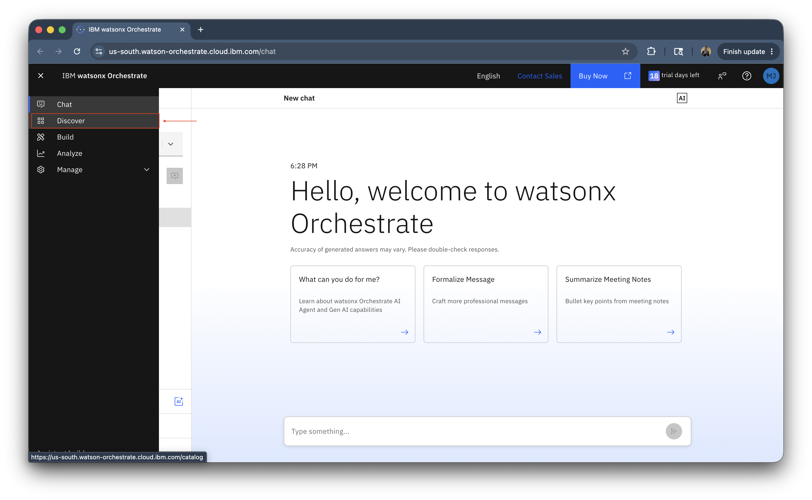

1. This is the agent and tools catalog where you can find pre-built agents and tools. There are over 300 pre-built agent and over 1130 pre-built tools. Also over 10 pre-built MCP servers. Under category, click on **IT**.
    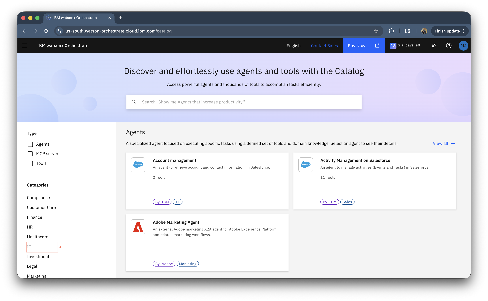

1. You will see the Asset Manager agent, we'll be using this pre-built agent. Click on it.
    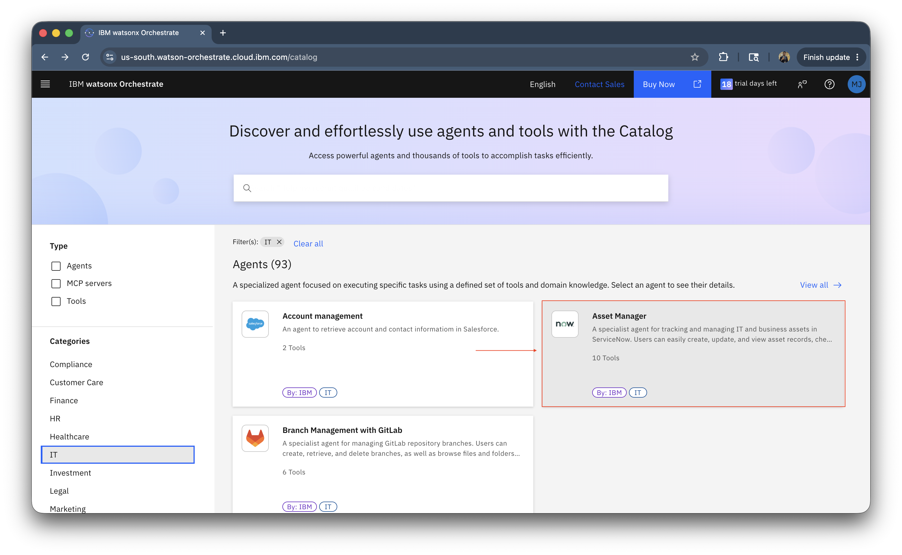

1. Review the Service Now tools being used for this agent and click on **use as template**.
    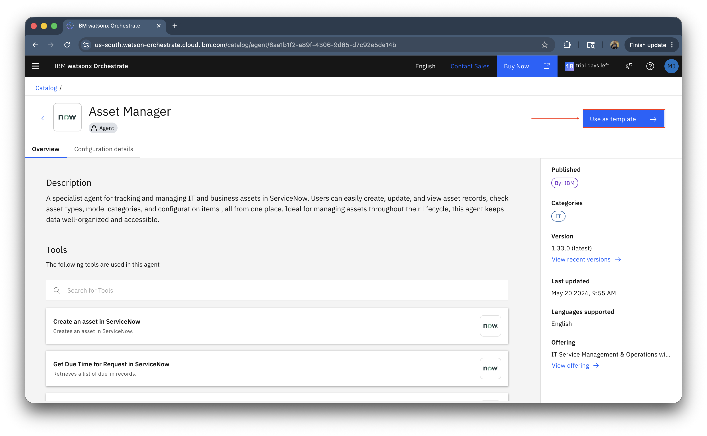

1. You will see the Asset Manager agent initialized, with tools, behavior and description.
    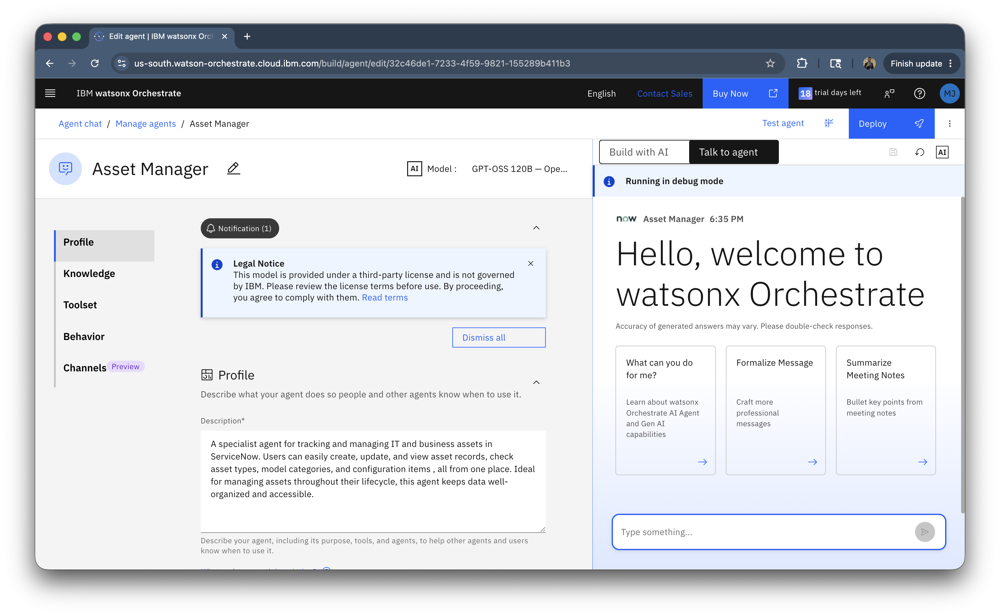

1. Click on **Toolset** > **Tools** and click on the three dot menu on any one of the tool and click on **edit details**.
    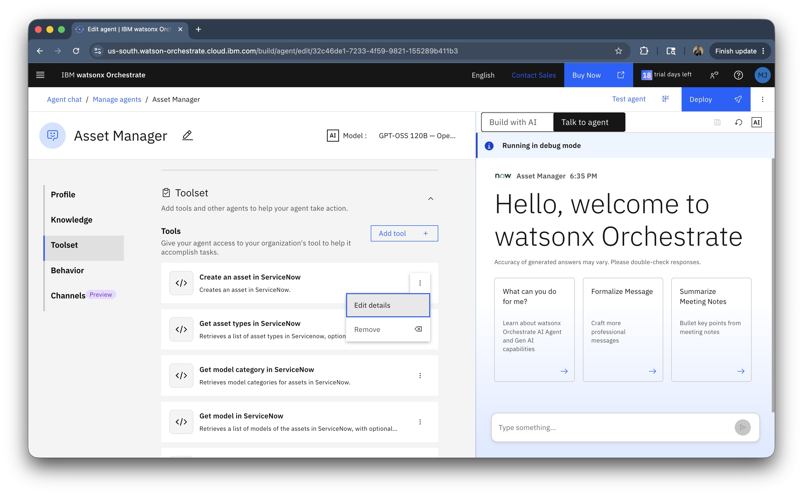

1. Go to **Connectors** tab, and you will see the OAuth2 connection variable.
    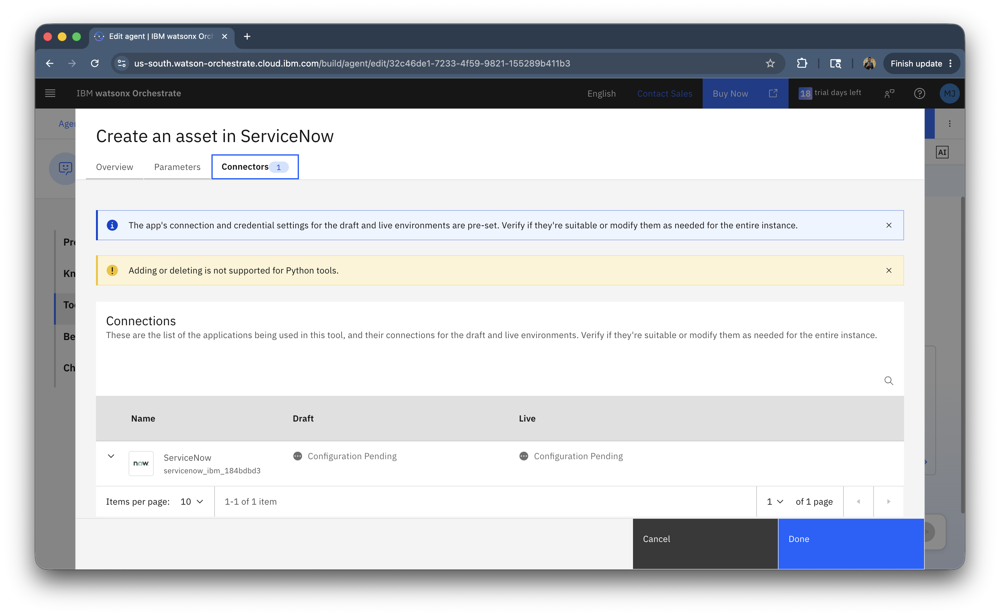

1. Click on the pencil icon to edit.
    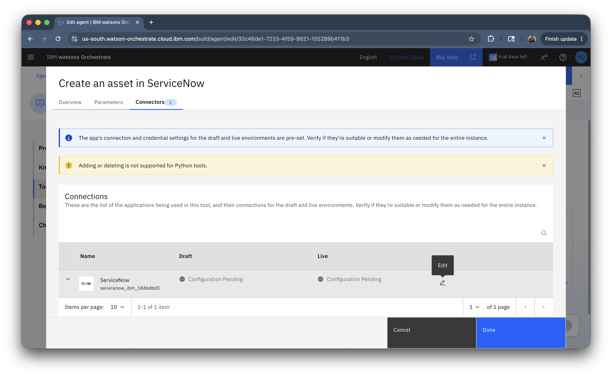

1. Select **OAuth2 Authorization Code**.
    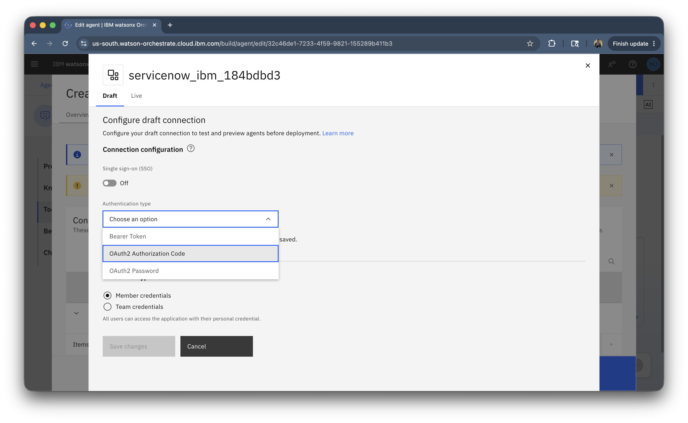

1. Enter the credentials that you generated in the [ServiceNow OAuth 2.0](#servicenow-oauth-20-setup-guide) step.
    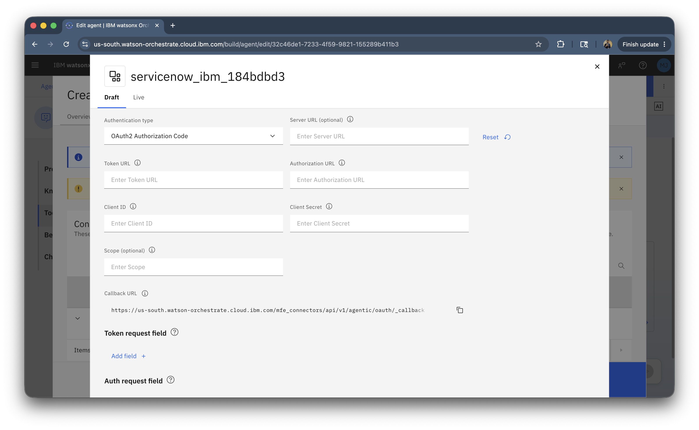

1. Do the similar configuration in **Live** environment and save the changes.
    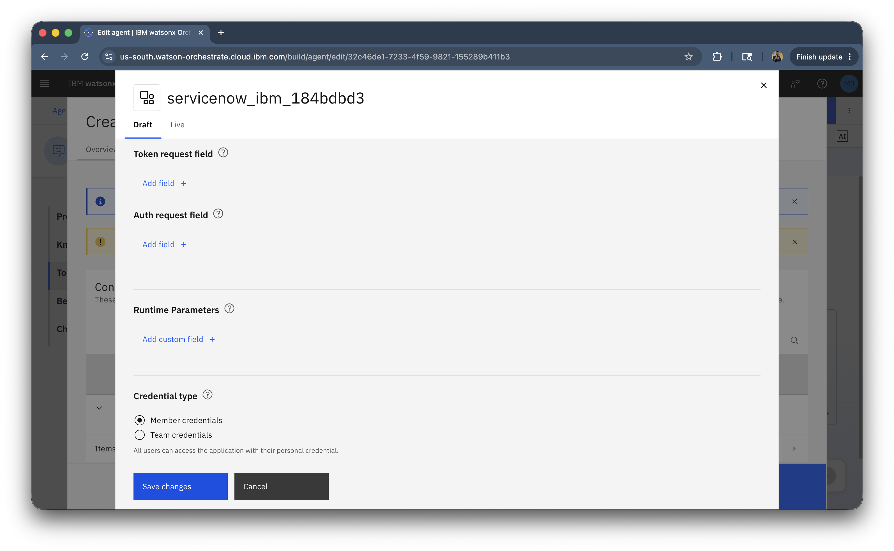

### Test

WIP

### Deploy

WIP!

### Monitor

WIP!

## Integration with Other Systems

The IT Service Manager can be extended to integrate with:

- **Email Systems:** Auto-create incidents from support emails
- **Monitoring Tools:** Create incidents from system alerts
- **HR Systems:** Link to employee records for asset assignment
- **Procurement Systems:** Automate equipment ordering
- **Communication Platforms:** Send notifications via Slack/Teams

## Security Considerations

- Use secure authentication for ServiceNow connection
- Implement role-based access control
- Encrypt sensitive data in transit
- Audit all agent actions
- Comply with data privacy regulations
- Regular security reviews and updates

## Next Steps

After completing this lab, consider:

- Integrating with additional ITSM modules (Change Management, Problem Management)
- Adding custom workflows for specific incident types
- Implementing advanced analytics and reporting
- Creating specialized agents for different IT teams
- Automating routine maintenance tasks
- Building integration with monitoring and alerting systems

## Summary

You have successfully configured and deployed an IT Service Manager agent that:

- Creates and manages IT incidents through natural language
- Provides access to knowledge base articles
- Handles task assignment and routing
- Manages IT assets and equipment requests
- Integrates seamlessly with ServiceNow ITSM
- Improves IT service delivery and user satisfaction

This agent significantly reduces the burden on IT support teams while providing employees with faster, more convenient access to IT services.

!!! success "Conclusion"

    👏 Congratulations on completing the lab! 🎉