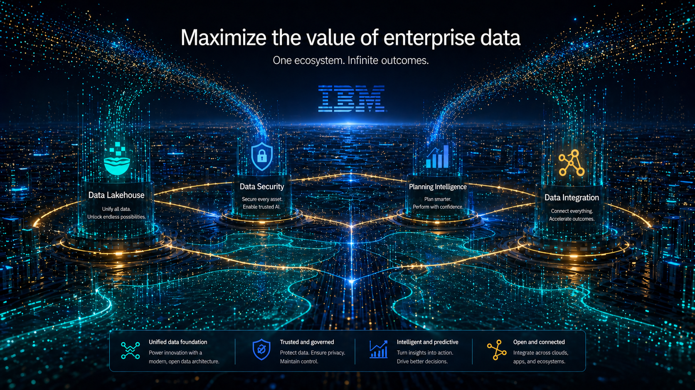
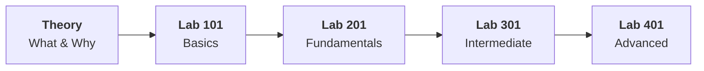

# Track 02 — Maximize the value of enterprise data

!!! warning "Work in progress!"
    This track is work in progress, please check back later.

*AI Generated image*

---

## Track Overview

| Field | Detail |
|-------|--------|
| **Product** | watsonx.data, Guardium, Planning Analytics, watsonx.data integration |
| **Target Persona** | _To be defined_ |
| **Theory sessions** | _To be defined_ |
| **Labs** | _To be defined_ |
| **Estimated Duration** | _To be defined_ |

---

## Learning Journey

## Before You Begin

- Complete the [Program Overview](../../program/overview.md) if you haven't already
- Ensure your lab environment is set up per the [Track 02 Lab Environment Setup Guide](lab-environment-setup.md)

---

## Track Sections

_To be defined_

<!-- - [Theory — What & Why](theory/what-and-why.md)
- [Theory — Product Overview](theory/product-overview.md)
- [Theory — Use Cases & Personas](theory/use-cases.md)
- [Lab 101 — Basics](labs/lab-101/overview.md)
- [Lab 201 — Fundamentals](labs/lab-201/overview.md)
- [Lab 301 — Intermediate](labs/lab-301/overview.md)
- [Lab 401 — Advanced](labs/lab-401/overview.md)
- [Troubleshooting](troubleshooting.md) -->