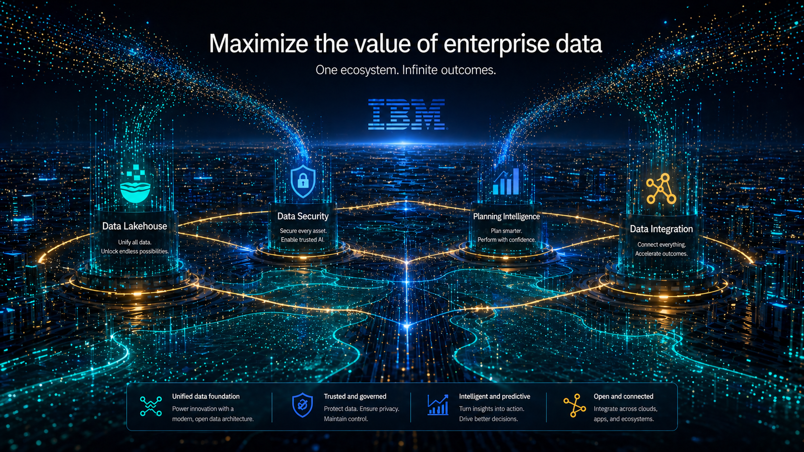
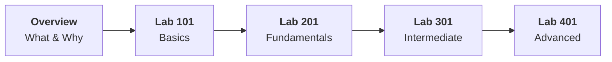

# Track 02 — Build intelligent applications

!!! danger "Work in progress"
    This track is work in progress check back later.

*AI Generated image*

## Track Overview

| Fields | Details |
|-------|--------|
| **Products** | :material-numeric-1-box: [watsonx.data](https://www.ibm.com/products/watsonx-data)  :material-numeric-2-box: [IBM Guardium](https://www.ibm.com/products/guardium-data-protection)   :material-numeric-3-box: [IBM Planning Analytics](https://www.ibm.com/products/planning-analytics)   :material-numeric-4-box: watsonx.data Integration |
| **Target Persona** | Select-t growth partners, Application Developers/Technical Leaders and Select-t clients|
| **Overview sessions** | 2 |
| **Lab sessions** | 4 |
| **Estimated Duration** | TBD |

---

## Learning Journey

```mermaid
flowchart LR
    theory["<strong>Overview</strong><br/>What & Why"] --> lab101["<strong>Lab 101</strong><br/>Basics"]
    lab101 --> lab201["<strong>Lab 201</strong><br/>Fundamentals"]
    lab201 --> lab301["<strong>Lab 301</strong><br/>Intermediate"]
    lab301 --> lab401["<strong>Lab 401</strong><br/>Advanced"]
```

<!-- !!! warning "Before You Begin"

    - Complete the [Program Overview](../../program/overview.md) if you haven't already.
    - Create an IBMid by referring to the [instructions here](../../facilitator/create-ibm-id.md).
    - Ensure your lab environment is set up per the [Track 02 Lab Environment Setup Guide](lab-environment-setup.md).

---

## Overview

- :material-lightbulb-on: **[Market Landscape of Intelligent Applications](theory/what-and-why.md)**
  Introduction to the market landscape and IBM's vision and offerings in that market.

- :material-package-variant: **[Product Overview](theory/product-overview.md)** 
  Introduction to the select-t focused products

---

## Hands-on Labs

### Lab 101 - Basics lab

!!! tip "Goal"
    In this basic lab, you'll learn core concepts, explore the architecture overview, and complete the foundational setup. You'll understand what watsonx.data does and why it exists through hands-on experience in your chosen domain.

-   :material-placeholder: **Lab 101 Use Case 1**

    ---

    Description coming soon.
    
    [:octicons-arrow-right-24: Start Lab](#){ .md-button .md-button--primary }

-   :material-placeholder: **Lab 101 Use Case 2**

    ---

    Description coming soon.
    
    [:octicons-arrow-right-24: Start Lab](#){ .md-button .md-button--primary }

!!! note "Learning Objectives"
    By the end of this lab, you will be able to:

    - TBD
    - TBD
    - TBD

---

### Lab 201 - Foundational lab

!!! tip "Goal"
    In this foundational lab, you'll build upon the basics and dive deeper into fundamental concepts. You'll work with more advanced features and learn how to implement practical solutions in your chosen domain.

-   :material-placeholder: **Lab 201 Use Case 1**

    ---

    Description coming soon.
    
    [:octicons-arrow-right-24: Start Lab](#){ .md-button .md-button--primary }

-   :material-placeholder: **Lab 201 Use Case 2**

    ---

    Description coming soon.
    
    [:octicons-arrow-right-24: Start Lab](#){ .md-button .md-button--primary }

!!! note "Learning Objectives"
    By the end of this lab, you will be able to:

    - TBD
    - TBD
    - TBD

---

### Lab 301 - Intermediate lab

!!! tip "Goal"
    In this intermediate lab, you'll tackle more complex scenarios and integrate multiple components. You'll learn advanced techniques and best practices for building production-ready intelligent applications in your domain.

-   :material-placeholder: **Lab 301 Use Case 1**

    ---

    Description coming soon.
    
    [:octicons-arrow-right-24: Start Lab](#){ .md-button .md-button--primary }

-   :material-placeholder: **Lab 301 Use Case 2**

    ---

    Description coming soon.
    
    [:octicons-arrow-right-24: Start Lab](#){ .md-button .md-button--primary }

!!! note "Learning Objectives"
    By the end of this lab, you will be able to:

    - TBD
    - TBD
    - TBD

---

### Lab 401 - Advanced lab

!!! tip "Goal"
    In this advanced lab, you'll learn about data governance, security, analytics integration, and implementing production-grade intelligent applications. You'll learn advanced techniques and best practices for building production-ready solutions in your domain.

-   :material-placeholder: **Lab 401 Use Case 1**

    ---

    Description coming soon.
    
    [:octicons-arrow-right-24: Start Lab](#){ .md-button .md-button--primary }

-   :material-placeholder: **Lab 401 Use Case 2**

    ---

    Description coming soon.
    
    [:octicons-arrow-right-24: Start Lab](#){ .md-button .md-button--primary }

!!! note "Learning Objectives"
    By the end of this lab, you will be able to:

    - TBD
    - TBD
    - TBD

---

## Support

- :material-wrench: **[Troubleshooting](troubleshooting.md)**
  Common issues and solutions

 -->

## Hands-on Labs

### Lab 101 - Basics lab

!!! tip "Goal"
    In this basic lab, you'll learn core concepts, explore the architecture overview, and complete the foundational setup. You'll understand the key products and why they exist through hands-on experience in your chosen domain.

-   :material-stethoscope: **Early Diagnostics Detector**

    ---

    Coming soon.

    [:octicons-arrow-right-24: Start Lab](labs/lab-101/healthcare/early-diagnostics-detector/details.md){ .md-button .md-button--primary }

!!! note "Learning Objectives"
    By the end of this lab, you will be able to:

    - TBD
    - TBD
    - TBD

---

### Lab 201 - Fundamentals lab

!!! tip "Goal"
    In this foundational lab, you'll build upon the basics and dive deeper into core platform capabilities. You'll work with more advanced features and learn how to implement practical intelligent application solutions in your chosen domain.

-   :material-bullhorn: **Marketing Campaign Generation**

    ---

    Coming soon.

    [:octicons-arrow-right-24: Start Lab](labs/lab-201/marketing/marketing-campaign-generation/details.md){ .md-button .md-button--primary }

!!! note "Learning Objectives"
    By the end of this lab, you will be able to:

    - TBD
    - TBD
    - TBD

---

Lab related support: TBD