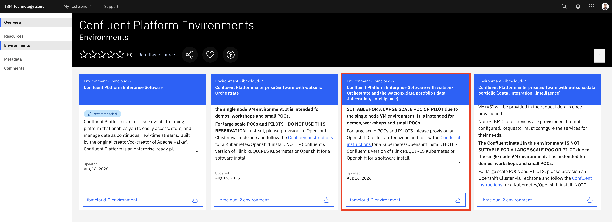
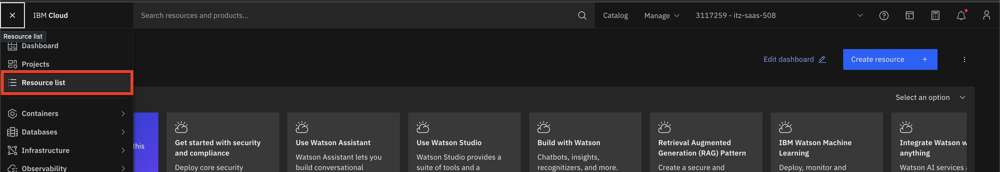
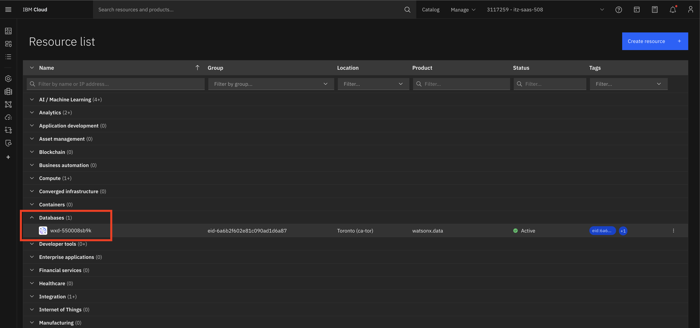
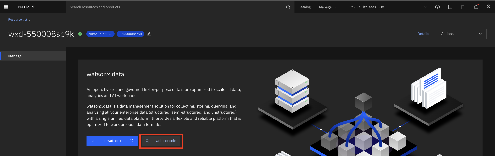

# Lab Environment Setup

Provision and validate all lab environments **at least 12 hours before** the session.

---

## Track 02 Products

This track focuses on:

- [watsonx.data](https://www.ibm.com/products/watsonx-data)
- [watsonx.data Intelligence](https://www.ibm.com/products/watsonx-data-intelligence)
- [watsonx.data Integration](https://www.ibm.com/products/watsonx-data-integration)

---

## Environment Details

| Requirement | Detail |
|-------------|--------|
| **Platform** | IBM TechZone |
| **Accounts needed** | One IBM Cloud account per attendee |
| **Pre-provisioned resources** | watsonx.data SaaS environment watsonx Orchestrate Cloud Object Storage (COS) bucket |
| **Network** | Stable internet, no restrictive firewall Access to IBM Cloud domains Access to `*.ibm.com` and `*.cloud.ibm.com` endpoints |
| **Attendee machine** | Any OS with a modern browser (Chrome/Firefox/Edge) |

!!! note "Operating system"
    No local CLI installation is required for Lab 101. All steps are performed via the watsonx.data web console.

---

## Setup Steps

### Step 1 — Create an IBM ID

If you don't have an IBMid, create one before proceeding:

[:material-check: Create your IBMid](../../facilitator/create-ibm-id.md){ .md-button .md-button--primary }

### Step 2 — Reserve the TechZone environment

1. Go to the TechZone collection:

    [:material-open-in-new: Open TechZone Collection](https://techzone.ibm.com/collection/confluent-platform-environments/environments){ target="_blank" .md-button .md-button--primary }

2. On the **Environments** tab, find and select the environment named:

    > **Confluent Platform Enterprise Software with watsonx Orchestrate and the watsonx.data portfolio (.data, .integration, .intelligence)**

    This is the **third tile** (highlighted below):

    

3. Click **Reserve** and fill in the reservation details (purpose, dates, etc.).
4. Submit the reservation.

!!! note "What this environment includes"
    - **watsonx Orchestrate** instance
    - **watsonx.data SaaS** environment
    - **Cloud Object Storage (COS)** bucket — pre-configured and ready to use

!!! warning "Reservation email"
    After the reservation is complete, you will receive an email from IBM TechZone. You will then receive a second email from IBM Cloud inviting you to join the provisioned account. **You do not need to create a new IBM Cloud account or provide a credit card.**

### Step 3 — Accept the IBM Cloud account invitation

1. Check your email for an invitation from **IBM Technology Zone** (`noreply@techzone.ibm.com`).
2. Open the email and click the **"Please go HERE to accept your invitation"** link.
3. Log in with your IBMid to join the provisioned IBM Cloud account.

!!! info "Missed the email?"
    You can find the invitation at: [https://cloud.ibm.com/notifications?type=account](https://cloud.ibm.com/notifications?type=account){:target="_blank"}

### Step 4 — Launch the watsonx.data console

1. Log in to [IBM Cloud](https://cloud.ibm.com){:target="_blank"} using your IBMid.
2. From the left navigation menu, click **Resource list**.

    

3. Expand the **Databases** section and click on your **watsonx.data** instance. The status should show **Active**.

    

4. On the instance page, click **Open web console** to launch the watsonx.data UI.

    

### Step 5 — Verify the COS bucket in watsonx.data

The COS bucket is pre-configured in your TechZone environment. Verify it is registered in watsonx.data:

1. In the watsonx.data console, go to **Infrastructure manager**.
2. Confirm that your COS bucket appears under the **Storage** section.
3. If it is not registered, click **Add component** → **Storage** and follow the prompts to connect your COS bucket using your IBM Cloud COS credentials.

---

## Pre-Lab Checklist

Before each lab session, verify:

:material-check: IBMid created and active

:material-check: TechZone environment reserved and IBM Cloud invitation accepted

:material-check: watsonx.data web console is accessible

:material-check: **Data manager** page loads and shows the **Ingest data** button

:material-check: COS bucket appears in watsonx.data Infrastructure Manager

:material-check: Sample CSV file is uploaded to the COS bucket (for Lab 101 Part 2)

:material-check: Network connectivity is stable

---

## Troubleshooting

| Issue | Solution |
|-------|----------|
| Cannot access TechZone | Ensure you have an active IBMid at [https://ibm.com/account](https://ibm.com/account) |
| Did not receive IBM Cloud invitation email | Check [https://cloud.ibm.com/notifications?type=account](https://cloud.ibm.com/notifications?type=account) |
| watsonx.data console not loading | Check that the instance status is **Active** in the IBM Cloud resource list |
| **Ingest data** button not visible | Ensure your IBM Cloud IAM role includes **Writer** or **Manager** permissions on the watsonx.data instance |
| COS bucket not appearing in Infrastructure Manager | Verify the COS HMAC credentials are correctly entered when registering the storage |
| File upload failing in local ingestion | Check that the file size is under **2 GB** and the format is one of `.csv`, `.parquet`, `.json`, `.avro`, `.orc`, `.txt` |
