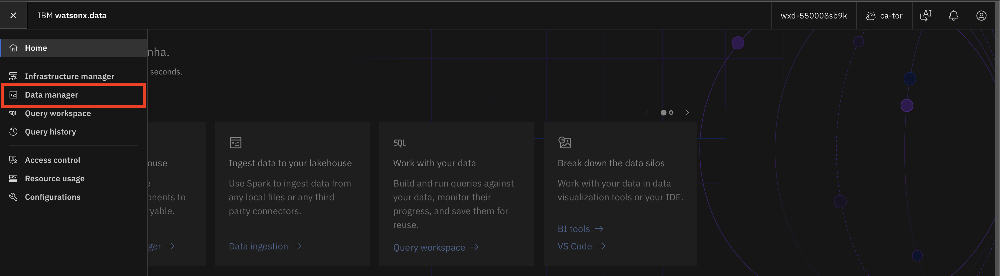
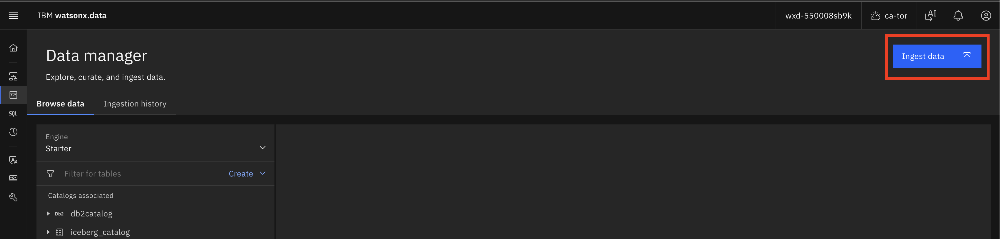
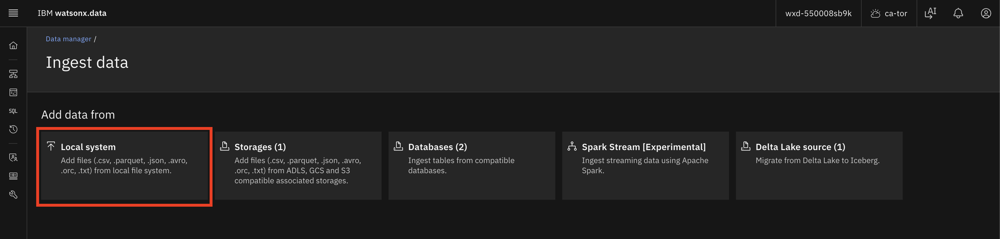
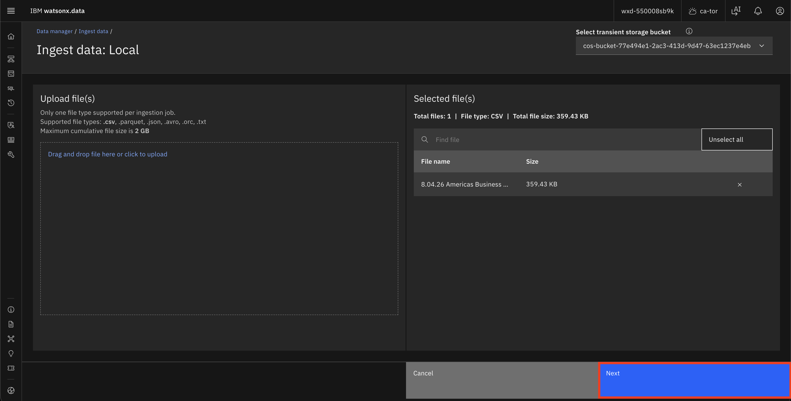
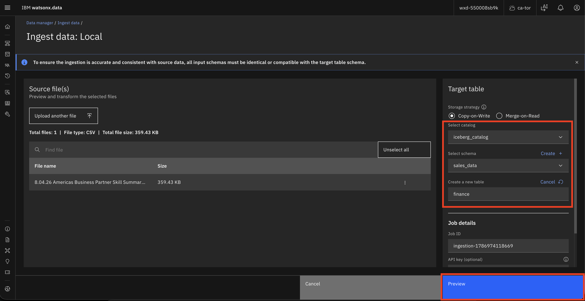
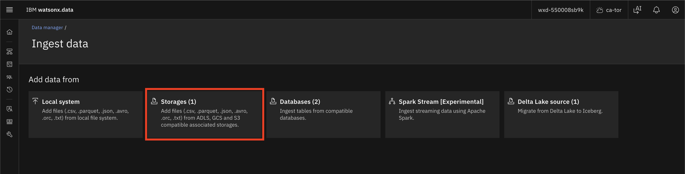
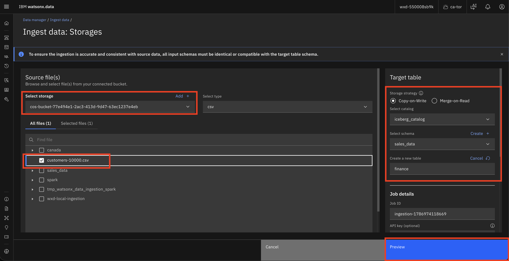
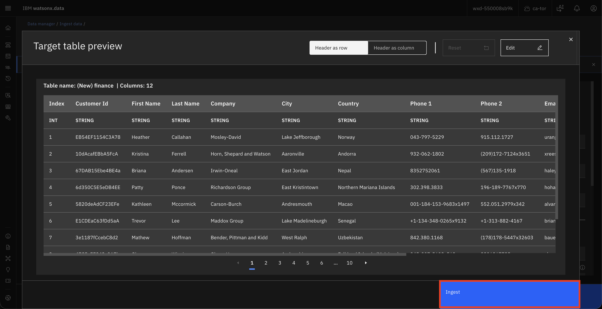
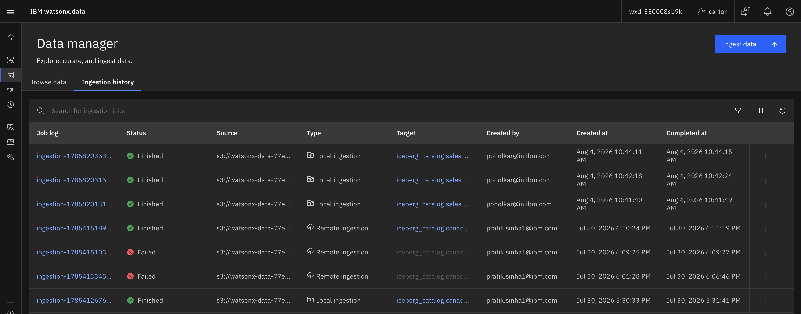

# Lab Guide — Getting Started with Data Ingestion in watsonx.data

## Overview

This lab walks you through two methods of ingesting financial data into IBM watsonx.data:

1. **Direct ingestion from a local CSV file** — upload a file directly from your machine via the watsonx.data web console.
2. **Ingestion from Cloud Object Storage (COS)** — load a CSV file already stored in a COS bucket via a registered storage connection.

## Pre-requisites

- Access to an IBM watsonx.data web console.
- A sample CSV file containing financial records (e.g. transactions, customer data).
- A Cloud Object Storage bucket with the CSV file uploaded (for Part 2).

---

## Part 1 — Direct Ingestion from a Local CSV File

In this part, you will ingest a CSV file directly from your local machine using the watsonx.data **Data Manager**.

### Step 1 — Log in and navigate to Data Manager

1. Open your browser and navigate to your watsonx.data instance URL.
2. Enter your credentials and click **Log in**.
3. From the left navigation menu, click **Data manager**.

### Step 2 — Click Ingest data

1. In the **Data manager** page, click the blue **Ingest data** button in the top-right corner.

### Step 3 — Select Local system as the source

1. On the **Ingest data** page under **Add data from**, click the **Local system** tile.
    - This option supports `.csv`, `.parquet`, `.json`, `.avro`, `.orc`, and `.txt` files from your local file system.

### Step 4 — Upload your CSV file

1. On the **Ingest data: Local** page, drag and drop your CSV file into the upload area, or click **Drag and drop file here or click to upload** to browse and select it.
2. Once selected, the file will appear in the **Selected file(s)** panel on the right showing the file name and size.
3. Click **Next**.

### Step 5 — Configure the target table

1. On the next screen, review the **Source file(s)** panel confirming your file is listed.
2. In the **Target table** panel on the right:
    - Select **catalog** (e.g. `iceberg_catalog`).
    - Select **schema** (e.g. `sales_data`).
    - Under **Create a new table**, enter a table name (e.g. `finance`).
3. Click **Preview** to verify the data before ingesting.

### Step 6 — Preview and Ingest

1. The **Target table preview** modal will open showing the detected columns and sample rows (e.g. `Customer Id`, `First Name`, `Last Name`, `Company`, `City`, `Country`, etc.).
2. Verify the column names and data types look correct.
3. Click **Ingest** to start the ingestion job.

!!! success "Part 1 Complete"
    Your CSV file has been ingested from your local machine into the `finance` table in watsonx.data.

---

## Part 2 — Ingestion from Cloud Object Storage (COS)

In this part, you will load a CSV file from a COS bucket that is already registered as a storage connection in watsonx.data.

!!! note "Pre-requisite for Part 2"
    Make sure your CSV file is already uploaded to your COS bucket, and that the COS bucket is registered as a **Storage** connection in watsonx.data's Infrastructure Manager.

### Step 1 — Navigate to Data Manager and click Ingest data

1. From the left navigation menu, click **Data manager**.
2. Click the blue **Ingest data** button in the top-right corner.

### Step 2 — Select Storages as the source

1. On the **Ingest data** page, click the **Storages (1)** tile.
    - This option supports files from ADLS, GCS, and S3-compatible associated storages.

### Step 3 — Select your COS bucket and CSV file

1. On the **Ingest data: Storages** page, use the **Select storage** dropdown to choose your COS bucket (e.g. `cos-bucket-77e494e1-2ac3-413d-9d47-63ec1237e4eb`).
2. Set the **Select type** dropdown to `csv`.
3. The file browser will display the contents of your bucket. Check the box next to your CSV file (e.g. `customers-10000.csv`).
4. In the **Target table** panel on the right:
    - Select **catalog** (e.g. `iceberg_catalog`).
    - Select **schema** (e.g. `sales_data`).
    - Under **Create a new table**, enter a table name (e.g. `finance`).
5. Click **Preview**.

### Step 4 — Preview and Ingest

1. The **Target table preview** modal will open showing the detected schema and sample rows.
2. Verify the columns and data types are correct.
3. Click **Ingest** to start the job.

### Step 5 — Check Ingestion history

1. Once submitted, go back to **Data manager** and click the **Ingestion history** tab.
2. Your job will appear in the list. Click on the **Job log** link to see the details.
3. A status of **Finished** (green tick) confirms the job completed successfully.

!!! success "Part 2 Complete"
    Your CSV file has been ingested from Cloud Object Storage into the `finance` table in watsonx.data.

---

## Summary

| | Part 1 | Part 2 |
|---|---|---|
| **Source** | Local system (your machine) | Cloud Object Storage bucket |
| **Tile to select** | **Local system** | **Storages** |
| **File picked from** | Local disk via drag-and-drop | COS bucket file browser |
| **Use case** | Quick ad-hoc ingestion | Scalable, production-grade ingestion |

!!! success "Conclusion"

    👏 Congratulations on completing the lab! You have successfully ingested financial data into watsonx.data using both local file upload and Cloud Object Storage. 🎉
