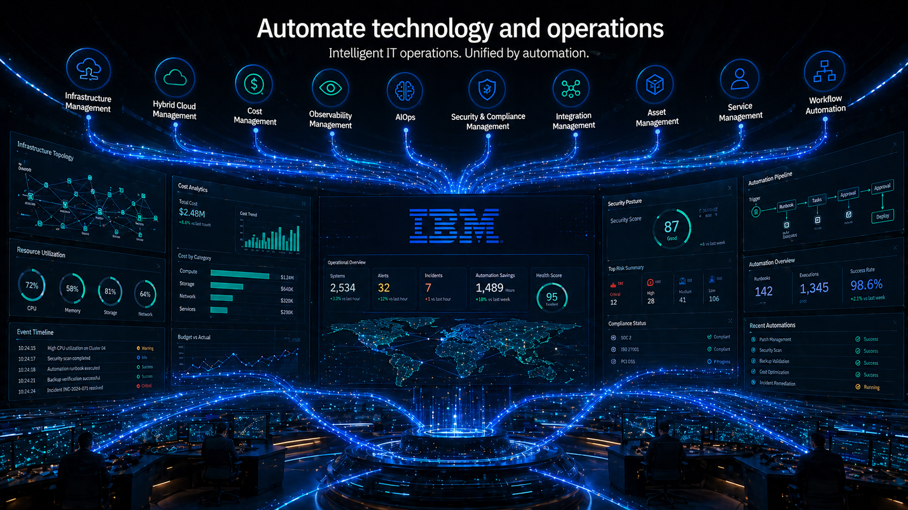
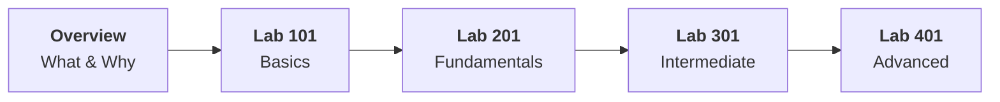

# Track 03 — Automate technology and operations

!!! danger "Work in progress"
    This track is work in progress check back later.

*AI Generated image*

## Track Overview

| Fields | Details |
|-------|--------|
| **Products** | :material-numeric-1-box: [IBM Maximo Application Suite](https://www.ibm.com/products/maximo)  :material-numeric-2-box: Terraform  :material-numeric-3-box: Cloudability  :material-numeric-4-box: Kubecost  :material-numeric-5-box: Instana  :material-numeric-6-box: Concert  :material-numeric-7-box: Vault  :material-numeric-8-box: Verify  :material-numeric-9-box: NS1  :material-numeric-10-box: WebMethods Hybrid Integration |
| **Target Persona** | Select-t growth partners, Operations/Technical Leaders, Asset Managers, and Select-t clients|
| **Overview sessions** | 2 |
| **Lab sessions** | 4 |
| **Estimated Duration** | ~20 hrs (excluding breaks) |

---

## Learning Journey

!!! warning "Before You Begin"

    - Complete the [Program Overview](../../program/overview.md) if you haven't already.
    - Create an IBMid by referring to the [instructions here](../../facilitator/create-ibm-id.md).
    - Ensure your lab environment is set up per the [Maximo Lab Environment Setup Guide] (Coming Soon).

---

## Overview

- :material-lightbulb-on: **[Market Landscape](theory/what-and-why.md)**
  Introduction to the asset management and operations automation market landscape and IBM's vision and offerings.

- :material-package-variant: **[Maximo Application Suite — Product Overview](theory/product-overview.md)** 
  Introduction to IBM Maximo Application Suite and its focused products for asset management and operations automation.

---

## Hands-on Labs

### Lab 101 - Basics lab

!!! tip "Goal"
    In this basic lab, you'll learn core concepts of IBM Maximo Application Suite, explore the architecture overview, and complete the foundational setup. You'll understand asset management fundamentals, work order management, and the EAM (Enterprise Asset Management) foundation through hands-on experience.

-   :material-wrench-cog: **Core Manage**

    ---

    Introduction to MAS Manage: assets, locations, work orders & Manage architecture in the EAM foundation. Learn the fundamentals of asset lifecycle management, location hierarchies, and work order creation and tracking within the Maximo platform.
    
    [:octicons-arrow-right-24: Start Lab](labs/lab-101/maximo/use-case-1/details.md){ .md-button .md-button--primary }

-   :material-file-tree: **Core MREF**

    ---

    Explore Maximo Reference Data: classification, domains & master data that underpin all MAS modules. Understand how reference data structures, classification hierarchies, and domain values form the foundation for consistent asset management across the organization.
    
    [:octicons-arrow-right-24: Start Lab](labs/lab-101/maximo/use-case-2/details.md){ .md-button .md-button--primary }

!!! note "Learning Objectives"
    By the end of this lab, you will be able to:

    - Navigate the MAS Manage interface and understand its architecture
    - Create and manage assets, locations, and work orders
    - Understand Maximo Reference Data (MREF) structures
    - Work with classification systems and domain values
    - Manage master data that supports asset management operations

---

### Lab 201 - Foundational lab

!!! tip "Goal"
    In this foundational lab, you'll build upon the basics and dive deeper into advanced asset management capabilities. You'll work with preventive maintenance, mobile operations, and infrastructure deployment to implement practical solutions for enterprise asset management.

- :material-calendar-clock: **Advanced Manage**
  
    ---

    Work management, preventive maintenance, purchasing, Work Centers, KPIs & admin configuration. Learn to set up recurring maintenance schedules, manage procurement workflows, configure work centers, and establish key performance indicators for operational excellence.

    [:octicons-arrow-right-24: Start Lab](labs/lab-201/maximo/use-case-1/details.md){ .md-button .md-button--primary }

- :material-file-document-multiple: **Advanced MREF**

    ---

    Classification structures, condition monitoring, failure codes (FMEA) & reference hierarchy management. Master advanced classification techniques, implement condition-based monitoring strategies, and leverage FMEA (Failure Mode and Effects Analysis) for predictive maintenance.

    [:octicons-arrow-right-24: Start Lab](labs/lab-201/maximo/use-case-1/details.md){ .md-button .md-button--primary }

- :material-cloud-upload: **Infra & Install**

    ---

    MAS deployment on OpenShift, installation via Db2 & MongoDB config, and environment management. Gain hands-on experience deploying Maximo Application Suite on OpenShift, configuring database backends, and managing multi-environment deployments.

    [:octicons-arrow-right-24: Start Lab](labs/lab-201/maximo/use-case-1/details.md){ .md-button .md-button--primary }

- :material-cellphone-link: **Mobile (Functional)**

    ---

    Work order management on mobile, inspection forms, crew scheduling & offline field operations. Enable field technicians with mobile capabilities for work order execution, digital inspections, crew coordination, and offline data synchronization.

    [:octicons-arrow-right-24: Start Lab](labs/lab-201/maximo/use-case-1/details.md){ .md-button .md-button--primary }

!!! note "Learning Objectives"
    By the end of this lab, you will be able to:

    - Configure and manage preventive maintenance programs
    - Set up purchasing workflows and work centers
    - Deploy MAS on OpenShift with proper database configuration
    - Enable mobile workforce with inspection forms and offline capabilities
    - Implement FMEA-based failure prediction strategies

---

### Lab 301 - Intermediate lab

!!! tip "Goal"
    In this intermediate lab, you'll tackle more complex scenarios integrating IoT data, building monitoring dashboards, and implementing health scoring for predictive maintenance. You'll learn advanced techniques for real-time asset visibility and data-driven decision making.

- :material-monitor-dashboard: **Monitor**
  
    ---

    Connect IoT data, build dashboards, set alert thresholds & use EDC for managed gateway scenarios. Learn to integrate sensor data streams, create real-time monitoring dashboards, configure intelligent alerting, and leverage Edge Data Collector for distributed asset monitoring.

    [:octicons-arrow-right-24: Start Lab](labs/lab-301/maximo/use-case-1/details.md){ .md-button .md-button--primary }

- :material-access-point: **IoT**

    ---

    Device registration, data ingestion pipelines, message schemas & sensor data to Monitor dashboards. Master IoT device onboarding, design data ingestion architectures, define message schemas, and visualize sensor telemetry in Monitor dashboards for actionable insights.

    [:octicons-arrow-right-24: Start Lab](labs/lab-301/maximo/use-case-1/details.md){ .md-button .md-button--primary }

- :material-heart-pulse: **Health**

    ---

    Asset health scores, custom contributor weightings, health rankings & linking insights to work orders. Implement comprehensive asset health scoring systems, configure custom health indicators, prioritize maintenance based on health rankings, and automate work order generation from health insights.

    [:octicons-arrow-right-24: Start Lab](labs/lab-301/maximo/use-case-1/details.md){ .md-button .md-button--primary }

- :material-briefcase-clock: **Field Service Mgmt**

    ---

    Service requests, scheduling optimization, technician dispatch, SLA management & work order lifecycle. Optimize field service operations with intelligent scheduling, automated technician dispatch, SLA tracking, and end-to-end work order lifecycle management for customer-facing services.

    [:octicons-arrow-right-24: Start Lab](labs/lab-301/maximo/use-case-1/details.md){ .md-button .md-button--primary }

!!! note "Learning Objectives"
    By the end of this lab, you will be able to:

    - Integrate IoT devices and sensor data into Maximo
    - Build real-time monitoring dashboards with alert thresholds
    - Implement asset health scoring and predictive maintenance strategies
    - Configure field service management with optimized scheduling
    - Link IoT insights directly to automated work order generation

---

### Lab 401 - Advanced lab

!!! tip "Goal"
    In this advanced lab, you'll explore cutting-edge capabilities including AI-powered services, computer vision for inspections, predictive analytics, and strategic asset investment planning. You'll learn to leverage AI and machine learning to transform asset management operations.

- :material-cellphone-cog: **Mobile (Customizations)**
  
    ---

    Custom forms, Application Designer tweaks, custom fields, branding & workflow actions in mobile. Master advanced mobile customization techniques including custom form design, Application Designer modifications, field-level customizations, corporate branding, and workflow automation for mobile users.

    [:octicons-arrow-right-24: Start Lab](labs/lab-401/maximo/use-case-1/details.md){ .md-button .md-button--primary }

- :material-robot: **AI Services**

    ---

    Maximo Assistant, Work Order Intelligence (job plan prediction) & FMEA-based failure prediction. Leverage AI-powered virtual assistants for natural language interactions, implement intelligent work order recommendations, and use machine learning for failure mode prediction and prevention.

    [:octicons-arrow-right-24: Start Lab](labs/lab-401/maximo/use-case-1/details.md){ .md-button .md-button--primary }

- :material-camera-iris: **Visual Inspection**

    ---

    Build CV models via MVI Training Server, deploy to MVI Edge 3.x & integrate results into Manage. Develop custom computer vision models for automated defect detection, deploy models to edge devices for real-time inspection, and seamlessly integrate inspection results into Maximo Manage workflows.

    [:octicons-arrow-right-24: Start Lab](labs/lab-401/maximo/use-case-1/details.md){ .md-button .md-button--primary }

- :material-chart-line: **Predict**

    ---

    Run Predict notebooks in CPMD; train failure prediction models & surface risk scores in Health. Utilize IBM Cloud Pak for Data to develop predictive maintenance models, train machine learning algorithms on historical failure data, and integrate risk scores into Health for proactive maintenance planning.

    [:octicons-arrow-right-24: Start Lab](labs/lab-401/maximo/use-case-1/details.md){ .md-button .md-button--primary }

- :material-strategy: **Reliability Strategies**

    ---

    RCM strategy design, failure mode analysis, maintenance strategy optimization & PM schedule linking. Implement Reliability-Centered Maintenance (RCM) methodologies, conduct comprehensive failure mode analysis, optimize maintenance strategies based on criticality, and link strategies to preventive maintenance schedules.

    [:octicons-arrow-right-24: Start Lab](labs/lab-401/maximo/use-case-1/details.md){ .md-button .md-button--primary }

- :material-finance-chart: **Asset Investment Planning**

    ---

    Build investment scenarios, compare risk-cost profiles & score assets for replacement or refurbishment. Develop strategic asset investment plans, perform cost-benefit analysis for replacement vs. refurbishment decisions, and prioritize capital investments based on risk, cost, and business impact.

    [:octicons-arrow-right-24: Start Lab](labs/lab-401/maximo/use-case-1/details.md){ .md-button .md-button--primary }

!!! note "Learning Objectives"
    By the end of this lab, you will be able to:

    - Customize mobile applications with advanced branding and workflows
    - Implement AI-powered assistants and intelligent work order recommendations
    - Build and deploy computer vision models for automated inspections
    - Develop predictive maintenance models using machine learning
    - Design reliability-centered maintenance strategies
    - Create strategic asset investment plans with risk-cost analysis

---

## Support

- :material-wrench: **[Troubleshooting](troubleshooting.md)**
  Common issues and solutions

