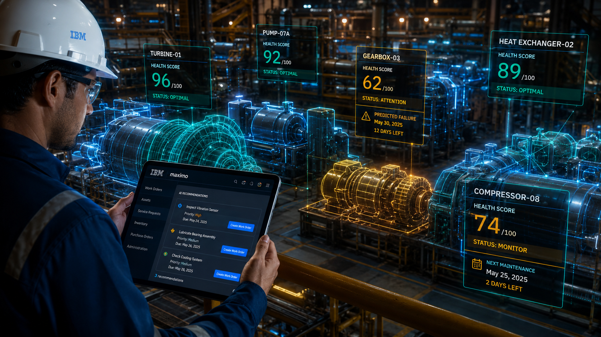

# IBM Maximo

IBM Maximo is a platform that helps organizations manage and maintain physical assets such as equipment, vehicles, factories, utilities, and infrastructure.

In simple terms, it acts as a central system for tracking the entire lifecycle of assets—from procurement and maintenance to repair and retirement. Teams can monitor asset health, schedule maintenance, manage work orders, and reduce unexpected downtime from a single platform.

IBM Maximo uses AI, analytics, and IoT data to help organizations predict failures before they happen. By analyzing sensor and operational data, it can recommend preventive maintenance actions, improve reliability, and extend the life of critical equipment.

The platform is widely used in asset-intensive industries such as manufacturing, energy, transportation, oil and gas, utilities, and government infrastructure. It also supports inventory management, inspections, compliance tracking, and mobile workforce operations.

Overall, it acts as an intelligent asset management system—helping organizations improve operational efficiency, reduce maintenance costs, and keep critical infrastructure running reliably.