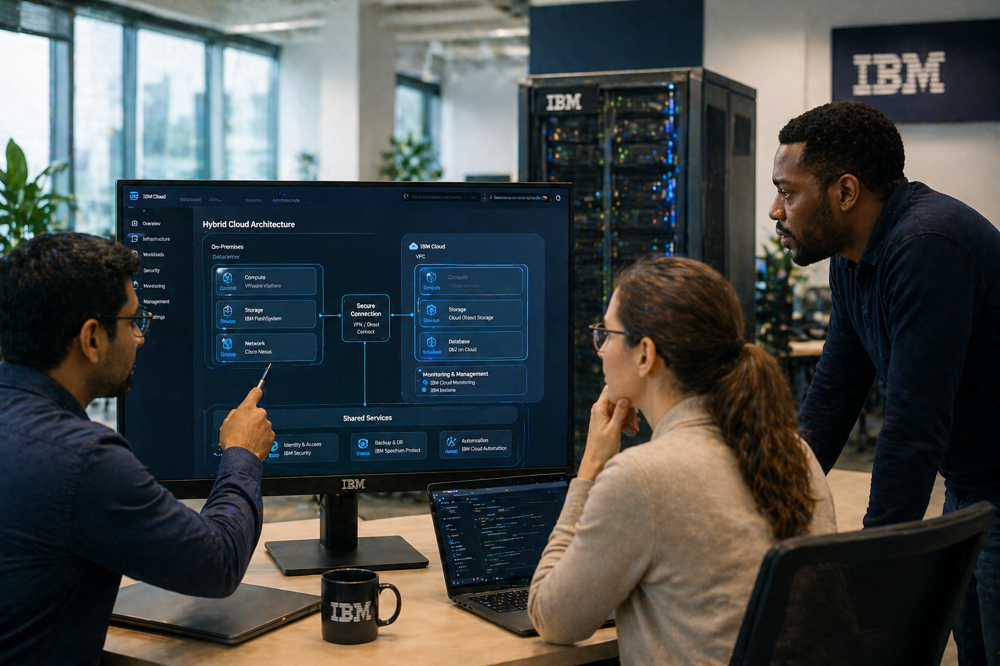
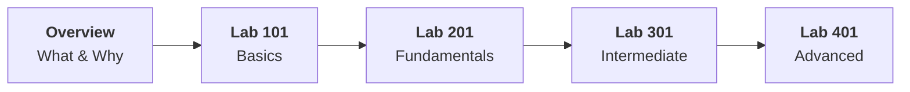

# Track 04 — Work across all environments with hybrid cloud

!!! danger "Work in progress"
    This track is work in progress check back later.

*AI Generated image*

## Track Overview

| Fields | Details |
|-------|--------|
| **Products** | :material-numeric-1-box: [IBM Power Virtual Server](https://www.ibm.com/products/power-virtual-server)  :material-numeric-2-box: [IBM Storage Fusion](https://www.ibm.com/products/storage-fusion)   :material-numeric-3-box: [IBM FlashSystem](https://www.ibm.com/products/flashsystem) |
| **Target Persona** | Select-t growth partners, Infrastructure/Technical Leaders and Select-t clients|
| **Overview sessions** | 2 |
| **Lab sessions** | 4 |
| **Estimated Duration** | TBD |

---

## Learning Journey

<!-- !!! warning "Before You Begin"

    - Complete the [Program Overview](../../program/overview.md) if you haven't already.
    - Create an IBMid by referring to the [instructions here](../../facilitator/create-ibm-id.md).
    - Ensure your lab environment is set up per the [Track 04 Lab Environment Setup Guide](lab-environment-setup.md).

---

## Overview

- :material-lightbulb-on: **[Market Landscape of Hybrid Cloud](theory/what-and-why.md)**
  Introduction to the market landscape and IBM's vision and offerings in that market.

- :material-package-variant: **[Product Overview](theory/product-overview.md)** 
  Introduction to the select-t focused products

---

## Hands-on Labs

### Lab 101 - Basics lab

!!! tip "Goal"
    In this basic lab, you'll learn core concepts, explore the architecture overview, and complete the foundational setup. You'll understand what IBM Power Virtual Server, Storage Fusion, and FlashSystem do and why they exist through hands-on experience in your chosen domain.

-   :material-placeholder: **Lab 101 Use Case 1**

    ---

    Description coming soon.
    
    [:octicons-arrow-right-24: Start Lab](#){ .md-button .md-button--primary }

-   :material-placeholder: **Lab 101 Use Case 2**

    ---

    Description coming soon.
    
    [:octicons-arrow-right-24: Start Lab](#){ .md-button .md-button--primary }

!!! note "Learning Objectives"
    By the end of this lab, you will be able to:

    - TBD
    - TBD
    - TBD

---

### Lab 201 - Foundational lab

!!! tip "Goal"
    In this foundational lab, you'll build upon the basics and dive deeper into fundamental concepts. You'll work with more advanced features and learn how to implement practical solutions in your chosen domain.

-   :material-placeholder: **Lab 201 Use Case 1**

    ---

    Description coming soon.
    
    [:octicons-arrow-right-24: Start Lab](#){ .md-button .md-button--primary }

-   :material-placeholder: **Lab 201 Use Case 2**

    ---

    Description coming soon.
    
    [:octicons-arrow-right-24: Start Lab](#){ .md-button .md-button--primary }

!!! note "Learning Objectives"
    By the end of this lab, you will be able to:

    - TBD
    - TBD
    - TBD

---

### Lab 301 - Intermediate lab

!!! tip "Goal"
    In this intermediate lab, you'll tackle more complex scenarios and integrate multiple components. You'll learn advanced techniques and best practices for building production-ready hybrid cloud solutions in your domain.

-   :material-placeholder: **Lab 301 Use Case 1**

    ---

    Description coming soon.
    
    [:octicons-arrow-right-24: Start Lab](#){ .md-button .md-button--primary }

-   :material-placeholder: **Lab 301 Use Case 2**

    ---

    Description coming soon.
    
    [:octicons-arrow-right-24: Start Lab](#){ .md-button .md-button--primary }

!!! note "Learning Objectives"
    By the end of this lab, you will be able to:

    - TBD
    - TBD
    - TBD

---

### Lab 401 - Advanced lab

!!! tip "Goal"
    In this advanced lab, you'll learn about enterprise-grade hybrid cloud deployments, high availability configurations, disaster recovery strategies, and implementing production-grade solutions. You'll learn advanced techniques and best practices for building production-ready hybrid cloud infrastructure in your domain.

-   :material-placeholder: **Lab 401 Use Case 1**

    ---

    Description coming soon.
    
    [:octicons-arrow-right-24: Start Lab](#){ .md-button .md-button--primary }

-   :material-placeholder: **Lab 401 Use Case 2**

    ---

    Description coming soon.
    
    [:octicons-arrow-right-24: Start Lab](#){ .md-button .md-button--primary }

!!! note "Learning Objectives"
    By the end of this lab, you will be able to:

    - TBD
    - TBD
    - TBD

---

## Support

- :material-wrench: **[Troubleshooting](troubleshooting.md)**
  Common issues and solutions

 -->

Lab related support: TBD